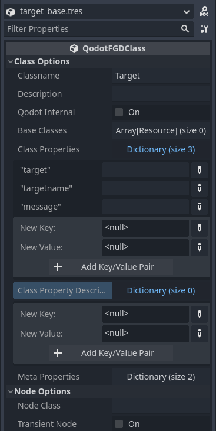
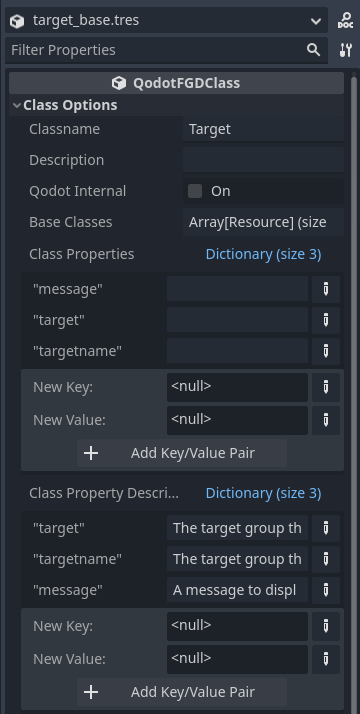
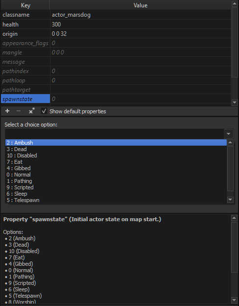
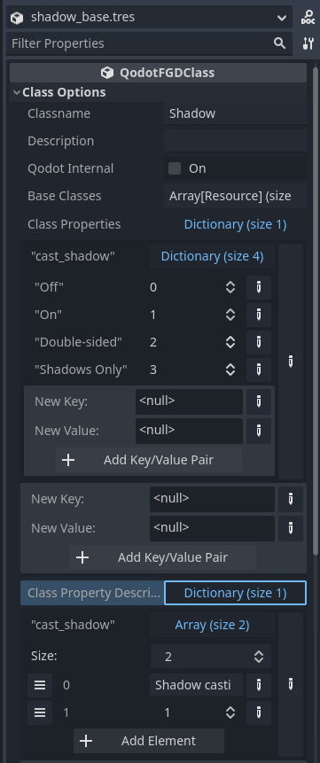
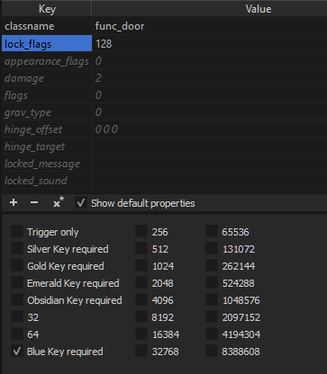
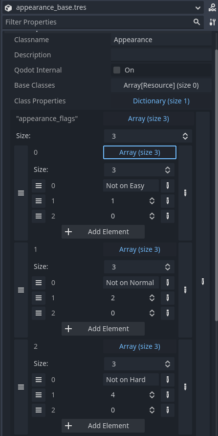
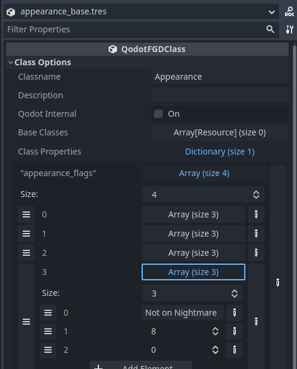
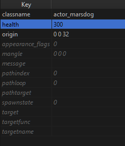
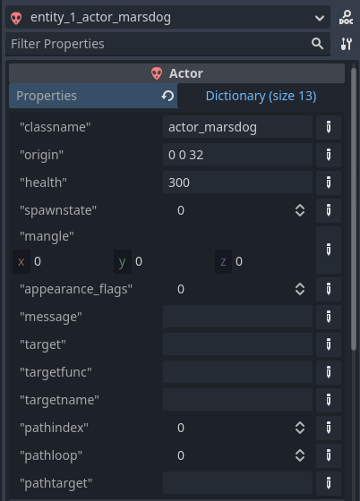

## Base Classes and Property Definitions

# The Entity Base Class

Base classes are pretty simple, honestly. They don't describe any specific entity but rather provide a template for other entities to inherit. They are also not exclusive to either entity class type: both _Solid Classes_ and _Point Classes_ can inherit the same base class. Base classes can also inherit other base classes!

_Can you get recursive with it?_<br>
No, Godot will stop you. Probably for the best.

<p align=center><br><br>

- `Classname` Unique class identifier in the FGD file.

- `Description` Description of entity seen in TrenchBroom. Can be overridden by inheriting entities.

- `Qodot Internal` If **true**, this entity will not be added to the FGD file, made unavailable in TrenchBroom, and only used during the Qodot build process. Not generally useful.
- `Base Classes` Other base classes to inherit properties from.

- `Class Properties` This is where your **Key Value Pairs** get defined. This is a pretty intense topic so we'll go over it in more detail later in this chapter.

- `Class Property Descriptions` This is where you set the description text for your properties, and also how you set default value for one of the property types. This is also a fairly intense topic we'll go over later.

- `Meta Properties` TrenchBroom editor appearance. These have no effect on the entity within Godot.

- `Node Class` Godot Node Classname to generate for this entity on map build. Setting this in a Base Class has no effect.

- `Transient Node` If **true**, removes this entity after building the _QodotMap_. Potential uses in modifying other Nodes in the SceneTree before removal, but generally leave this unchecked. Setting this in a Base Class has no effect, as the inheriting entity will override this property.

Let's go ahead and create a new **QodotFGDBaseClass** resource in our _res://tb/fgd/base/_ folder and call it `target_base.tres`. We'll set its _Classname_ to `Target` and use it to set up a basic scripting system.

<br>

# Class Properties! (And Their Descriptions!)

## FGD Property Types

TrenchBroom has access to the following property types:

- integer
- float
- string
- choices
- flags

_String_ properties are also used to define vectors as `X Y Z`, with a space between each vector component. If the property is defined in the _Entity Definition_ as a **Vector3** then Qodot will automatically convert this value into a Godot Vector3 Variant.

_Choices_ properties are actually an integer property but with the added benefit of providing a descriptive dropdown list.

_Flags_ properties are also an integer property, but with the added benefit of providing a list of checkboxes that create a bitmask.

## Defining Properties

_Class Properties_ are defined using a Dictionary, where each key is a String that represents a property's name and each value represents the property's type and, in most cases, its default value.
> _NOTE: Property names **cannot** have spaces. Use underscores instead._

For our _Target_ base class we just created, let's define some basic properties. Specifically, let's add 3.

- target
- targetname
- message

For their values, make them String types and leave them empty. When it comes time to reference these properties, we can choose to ignore them based off of whether the String is blank or not.

<p align=center><br>

Pretty easy! This is how you'll also construct _Integer_, _Float_, and _Vector3_ types. _Flags_ and _Choices_ are handled differently, but we'll get to them later.

### Defining Descriptions

But what about property descriptions? TrenchBroom can display additional information provided by the FGD file when a property is selected on an entity. Well we can define that in the _Class Property Descriptions_ array.

So for almost all property types, the description process is the same: the descriptions are added to a `Class Property Descriptions` Dictionary where each key is a String corresponding with a property's name. Where it differs is each description must be a String, with the exception of `Choices` properties (which we'll look at after).

Let's go ahead and add the following entries to our descriptions dictionary.

| Property | Description |
| --- | --- |
| target | The target group this entity belongs to. |
| targetname | The target group this entity targets upon being triggered. |
| message | A message to display to the Player upon this entity being triggered. |
<br>

<p align=center><br>

Looks good! And with that, there's nothing else to add to this particular base class.

_But what about Choices and Flags?_

Good question. Let's make another base class to learn about **Choices**.

## The Choices Property

Choices are a powerful property type in TrenchBroom in that they give us a descriptive and definitive list of options to choose from. Think of them like an enumerator.

<p align=center><br>

This is tremendously useful for what I hope are obvious reasons. But how do we populate this list using Qodot?

All **GeometryInstance3D** nodes in Godot have a property called [***cast_shadow***](https://docs.godotengine.org/en/4.1/classes/class_geometryinstance3d.html#class-geometryinstance3d-property-cast-shadow) that uses an enum type called [***ShadowCastingSetting***](https://docs.godotengine.org/en/4.1/classes/class_geometryinstance3d.html#enum-geometryinstance3d-shadowcastingsetting). This will be perfect to allow greater control over the display of things like map geometry and props.

Let's create a new base class in our _res://tb/fgd/base/_ folder and call it `shadow_base.tres`, then give it the classname `ShadowCast`. To keep parity between our TrenchBroom and Godot naming conventions, we'll name our new property `cast_shadow`.

However, what should its value type be? Even though it'll ultimately be read as an integer, we'll choose _Dictionary_ for the value type. That's right, _a Dictionary within a Dictionary_. ***Dickception***.

You might've guessed it with the dictionary value type, but basically we'll be adding each of our choices as a dictionary entry. The reason we don't use a String Array instead is probably part tech debt (Qodot 4 is based heavily on Qodot for Godot 3 and Godot 3 did not have Typed Arrays) and partly because Arrays are already used for Flags.

> _NOTE: Every value in the choices dictionary **must** be an integer._

Technically speaking you can put in other data types, but Qodot will turn the result into an integer upon build.

We'll create an entry for each _ShadowCastingSetting_ enum value.

| Key | Value |
| --- | --- |
| Off | 0 |
| On | 1 |
| Double-sided | 2 |
| Shadows Only | 3 |
<br>

_But wait: in the other property types, we define a default value by just entering a value in its entry!_

Well, in the wonderful world of Choices if we don't define a default value it becomes `0`. In this particular setting, 0 would mean our mesh _doesn't_ cast a shadow, which is typically undesired. So how do we set a default value?

### The Choices Description

As with every property description, you create an entry where the key matches with the key in the `Class Properties` Dictionary. The difference is the value. If you input a String value, you'll still get a description text but the default value becomes 0. Optionally, you can put in an Array with 2 elements: entry 0 is a String descriptor of the property, while entry 1 is the default integer value.

Create a new entry in your `Class Property Descriptions` Dictionary. Give it the key `cast_shadow`. For the value, create an _Array_ with a size of 2. For the first entry choose a _String_ type and enter `Shadow casting display setting.`. For the second entry choose an _Integer_ type and enter `1`.

<p align=center>

Now when Qodot builds this entity's properties dictionary we won't default to the _Off_ setting!

That's all we need for our _ShadowCast_ base class. Now it's time to learn more about how to set up bitmask flags.

## The Flags Property

Bitmasks are an important tool in any game developer's arsenal. They can be used for things like inventories or elemental resistances and weaknesses. [**Godot uses them for collision layers and masks**](https://docs.godotengine.org/en/4.1/tutorials/physics/physics_introduction.html#gui-example). Bitmasks are wonderful, and with a little setup we can take advantage of them in TrenchBroom. I highly recommend reading up on bitmasking if you aren't already familiar with it.

<p align=center><br>

Sometimes we want certain entities to show up only on certain difficulties. Typically this involves different enemy counts or placements, but another useful example is something like _Mega Man 2_'s Easy Mode which added extra platforms over certain death pits.

Quake handled this with an exclusion filter rather than an inclusion filter, meaning that if a bitflag was set and the difficulty matched the entity would be removed. This was done through a `spawnflags` property.

We'll adapt our next base class from that design. Create another new base class in the _res://tb/fgd/base/_ folder and call it `appearance_base.tres`. The classname should be `Appearance`.

We'll only be adding one property. The key should be called `appearance_flags`. Make the value type an _Array_. This is where it gets a little complicated.

Each entry in the _Flags_ array is an Array with 3 elements:
- The flag's name or description
- The flag's bit value
- The flag's default bit state

Add these Array elements to your property's Array:

| Array | Element | Entry |
| --- | --- | --- |
| 0 | 0 | Not on Easy |
| | 1 | 1 |
| | 2 | 0 |
| 1 | 0 | Not on Normal |
| | 1 | 2 |
| | 2 | 0 |
| 2 | 0 | Not on Hard |
| | 1 | 4 |
| | 2 | 0 |
<br>

Remember: the bit value 

### Flag Descriptions

It's not necessary to provide a property description for flags properties. You can enter a flag description in the Entity Definition resource but it will not export as the FGD format does not support flag property descriptions.

When you've finished your flags entries, you should have something like this:

<p align=center><br>

Upon building, Qodot will sum all of the enabled bit values to provide a single integer that you can use as a bitmask in your entity code.

## There has to be an Easier Way

While it's not too big of a deal to create simple String, integer, float, or Vector3 properties, Choices and Flags can be a bit cumbersome. Fortunately, Godot has got you covered!

The brilliant thing about the **.tres** format is that it is a _text resource_, meaning we can open them up in our favorite code text editors like [**Visual Studio Code**](https://code.visualstudio.com/), which has extensions for Godot Support.

Taking a look at our ***target_base.tres*** code, we can see it's pretty clear what's going on:

```gdscript
[gd_resource type="Resource" script_class="QodotFGDBaseClass" load_steps=2 format=3 uid="uid://bmahuo4dviu2f"]

[ext_resource type="Script" path="res://addons/qodot/src/resources/game-definitions/fgd/qodot_fgd_base_class.gd" id="1_25kye"]

[resource]
script = ExtResource("1_25kye")
classname = "Target"
description = ""
qodot_internal = false
base_classes = Array[Resource]([])
class_properties = {
"message": "",
"target": "",
"targetname": ""
}
class_property_descriptions = {
"message": "A message to display to the Player upon this entity being triggered.",
"target": "The target group this entity belongs to.",
"targetname": "The target group this entity targets upon being triggered."
}
meta_properties = {
"color": Color(0.8, 0.8, 0.8, 1),
"size": AABB(-8, -8, -8, 8, 8, 8)
}
node_class = ""
transient_node = false
```

All of the properties we talked about before are _right there_. Just ready to be modified!

What's neat is we can make our changes in this, save it, then hop back into Godot and the Entity Definition resource should be updated! Sometimes you can get an error that "this file is newer on disk", in which case you can reload the file rather than revert, but typically it just updates properly.

What about Choices and Flags? Dictionaries and Arrays? Take a look at ***shadow_base.tres***:

```gdscript
[gd_resource type="Resource" script_class="QodotFGDBaseClass" load_steps=2 format=3 uid="uid://j7emkky4pjco"]

[ext_resource type="Script" path="res://addons/qodot/src/resources/game-definitions/fgd/qodot_fgd_base_class.gd" id="1_b8mhy"]

[resource]
script = ExtResource("1_b8mhy")
classname = "Shadow"
description = ""
qodot_internal = false
base_classes = Array[Resource]([])
class_properties = {
"cast_shadow": {
"Double-sided": 2,
"Off": 0,
"On": 1,
"Shadows Only": 3
}
}
class_property_descriptions = {
"cast_shadow": ["Shadow casting display setting.", 1]
}
meta_properties = {
"color": Color(0.8, 0.8, 0.8, 1),
"size": AABB(-8, -8, -8, 8, 8, 8)
}
node_class = ""
transient_node = false
```

We can see our Choices Dictionary under class properties. Should be easy enough to add new elements. Now let's take a look at our ***appearance_base.tres*** code:

```gdscript
[gd_resource type="Resource" script_class="QodotFGDBaseClass" load_steps=2 format=3 uid="uid://u8jt3neti7vw"]

[ext_resource type="Script" path="res://addons/qodot/src/resources/game-definitions/fgd/qodot_fgd_base_class.gd" id="1_odfmh"]

[resource]
script = ExtResource("1_odfmh")
classname = "Appearance"
description = ""
qodot_internal = false
base_classes = Array[Resource]([])
class_properties = {
"appearance_flags": [["Not on Easy", 1, 0], ["Not on Normal", 2, 0], ["Not on Hard", 4, 0]]
}
class_property_descriptions = {}
meta_properties = {
"color": Color(0.8, 0.8, 0.8, 1),
"size": AABB(-8, -8, -8, 8, 8, 8)
}
node_class = ""
transient_node = false
```

Well, our `appearance_flags` array already looks far more readable to me. While Godot does get rid of most unnecessary white space in arrays, we can easily make it even more readable by altering the array a bit:

```gdscript
class_properties = {
"appearance_flags": [
    ["Not on Easy", 1, 0], 
    ["Not on Normal", 2, 0], 
    ["Not on Hard", 4, 0]
    ]
}
```

Let's say we want to quickly add a flag for Nightmare mode. We can easily just append a new element to the end...

```gdscript
class_properties = {
"appearance_flags": [
    ["Not on Easy", 1, 0], 
    ["Not on Normal", 2, 0], 
    ["Not on Hard", 4, 0],
    ["Not on Nightmare", 8, 0]
    ]
}
```

... save the resource, and then go back into Godot. Detecting a change in the resource, Godot automatically reimports it and we see our new flag has been added!

<p align=center><br>

I often find myself working between both Visual Studio Code for quick editing of larger property types and Godot for initial creation and managing inheritance. Use whatever work flow best suits your needs and knowledge!

## Undefined Key Value Pairs

Fun tip: you don't need to define a key value pair to add one! TrenchBroom will allow you to add new keys despite not being defined in the FGD. This can be pretty powerful in and of itself. Let's say we add the undefined key `health` to our `actor_marsdog`, and give it a value of `300`.

<p align=center><br>

When we build our map, Qodot sets our `properties` Dictionary to reflect the key values given in our map file.

<p align=center><br>

_What use would you have for something like this?_

I'll use the Marsdog example from above. The Marsdog as an enemy normally has 100 health. However, sometimes we may want to change its health to a different value, say for a scripted sequence or just a surprise variation. Since this key would be shared across every actor in a base class, we can't exactly put a default value of 0, or else Qodot would automatically set our Marsdog's health to 0 if we didnt' manually enter a value. We could just make it additive: the `health` value just gets added to our Marsdog's base health. But that doesn't seem terribly intuitive for a level designer. Also, what if the Marsdog's default health changes but the weapon power doesn't? It's more intuitive and reliable to have the `health` value be a setter rather than additive.

Well, if we just don't include the property in our definition it won't get automatically added with a default value. In our code we just have to make sure we check if the key exists in our `properties` Dictionary.

_Wouldn't it be more intuitive if Qodot just didn't add the property to the `properties` Dictionary if you didn't assign a value to it?_

That's how the previous version of Qodot worked in Godot 3.x, but was changed for the Godot 4 version. There are good arguments to be had on both sides of this particular debate, but as it stands this is just how Qodot for Godot 4 works. All I can do is tell you how to take advantage of it.

This covers pretty much all you need to know about **Base Classes** and **Class Properties**. We're still not quite ready yet to build our GameConfig and FGD though. Before we can do that we have to build our first actual entity!

### [**_Next Chapter: Solid Class Entities >>>_**](solidclass.md)