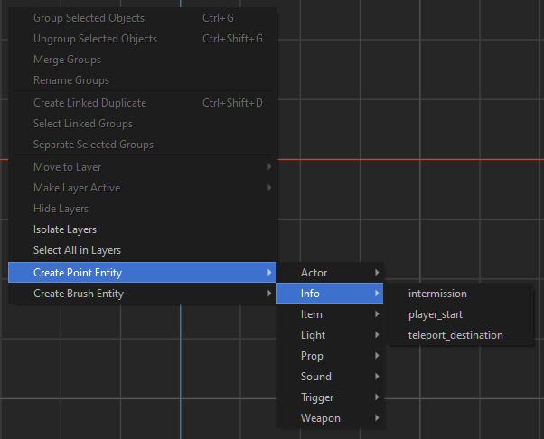
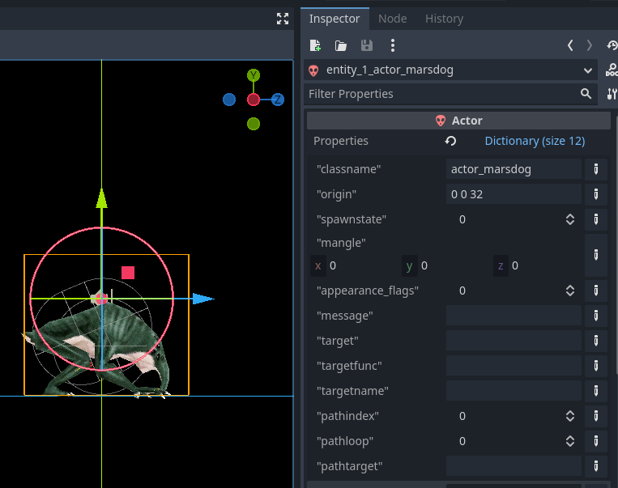

# What's an Entity?<br>

## You're an Entity! You're an Entity! You're an Entity!<br>

Before we jump into defining our game's entities, we should probably define what an entity _actually is_.

In terms of how to map with the TrenchBroom > Qodot > Godot pipeline, i'ts best to think of entities in Quake design terms. That is to say, everything is an entity: the player, the enemies, the ambient sounds, the doors, the lifts, the trigger areas, the map geometry itself… all of these should be thought of as **entities**.

TrenchBroom and Qodot support 2 different kinds of entities: **Solid (Brush) Entities** and **Point Entities**. Once we understand these 2 entity types and the full flexibility that Qodot offers us, we can completely design our maps in TrenchBroom and have Qodot translate them into Godot.

## Entity Definitions

Now that we know what entities are, how do we tell TrenchBroom and Godot what our entities are? TrenchBroom does this through the use of Game Configurations and FGD files. There is a whole chapter on FGD files later, but the basic function is to provide a list of all the available entities and their properties to TrenchBroom.

Let's take a look at an example entity from ***They Came From Dimension X***, the `actor_marsdog`.

<p align=center><br>

Every entity is comprised of 2 things: **Metadata** and **Key Value Pairs**. 

_Metadata_ tells TrenchBroom how to display your entity in the editor, things like bounding box color or display models for Point Entities, but otherwise have no effect in Godot.

_Key Value Pairs_ on the other hand can be thought of as your entity's properties, and every entity will have at least a `classname` key value pair that determines the kind of entity it is. These are perhaps the most important and powerful aspect of entities in this pipeline. We'll go over the details of key value pairs at length later on in this chapter, but one fun fact is that if you change the `classname` value to any other entity classname the currently selected entity will transform into the new entity type (eg: changing `actor_marsdog` to `actor_elderthing` will turn our Marsdog into an Elder Thing).

Qodot provides an easy way to define our entities and compile this FGD file through the use of Godot resources.

<p align=center><br>

**QodotFGDClass** is a parent class for entity definition resources that should not be used directly. You can probably gather what the **QodotFGDPointClass** and **QodotFGDSolidClass** resources do: define our _Point Class_ and _Solid Class_ entities respectively. But what about the **QodotFGDBaseClass** and **QodotFGDFile**?

The FGD format allows for entities to inherit from **Base Classes**, providing an easy way to reuse key / value pair setups. Base Classes themselves don't show up in the entity lists in TrenchBroom, meaning we won't clutter our menus up by having a dozen or so of them in our FGD. Nice.

The _QodotFGDFile_ resource defines our FGD file. We'll go over that in a later chapter, when the time is right.

## Naming Patterns

I mentioned before that every entity has a `classname`, one that we'll get to define in our Entity Definition resource. One important consideration to make is that _naming conventions matter_. The first word of an entity's name up until the first underscore will be provided its own group in TrenchBroom. Taking advantage of this can help keep your entities organized in a few spots and provide convenient filtering options.

<p align=center>


<br>

When combined with **TrenchBroom Tags** this feature gains additional powers, like in-editor transparency.

<p align=center><br>

Additionally, TrenchBroom also handles Point Class orientation through the key value pairs `angle` and `mangle` differently depending upon the `classname`. Setting the `mangle` for an entity type in the `light` group or with the `info_intermission` classname will have altered orientation behavior. To see the differences, you can look at [**the "demangler" static function**](https://github.com/RhapsodyInGeek/qodot-entities/blob/main/GDScript%202.0/demangler.gd) I created to handle translating TrenchBroom rotations into Godot rotations.

Anyway, just make sure to give a little bit more thought to your naming conventions.

## Key Value Pairs and the Properties Dictionary<br>

This is probably the most powerful feature of Qodot. This is what allows you to do ***anything***. Well, just about anything.

As mentioned before, all entities are comprised of **Key Value Pairs**. Each entity will _always_ have a `classname`. This classname is what Qodot uses to determine which entity will be built upon building the _QodotMap_. Also upon building, all of the entity's key value pairs will be added to a **`properties` Dictionary** (provided that the entity has one as an exported variant).

In Godot, your entity does not necessarily need a script. And even if you provide it a script, it does not need a `properties` dictionary. However, to take full advantage of Qodot's power it is highly recommended that you provide your entities both.

Let's take another look at that Marsdog, both in TrenchBroom and then in Godot.

<p align=center>
 

<br>

As you can see, all of the key values have been populated by Qodot in Godot. This is important to understand: if you don't give a key a value, it _**will**_ use the default. This is often handy, but occasionally we'll want to work around this.

And this is the key to importing all of your design work through Qodot. On their own the key values don't mean anything, but combined with a script you can do all sorts of things. An example below illustrates a custom **Worldspawn** entity that no longer generates geometry or collision but is instead a `WorldEnvironment` class node.

In TrenchBroom we have our `worldspawn` settings set up like this in our FGD.
<p align=center><br>

Then in Godot, when the map is built and the Worldspawn's `properties` Dictionary is set, it runs the script below.

```gdscript
@export var properties: Dictionary = {} :
	set(value):
		properties = value;
		if !Engine.is_editor_hint():
			return

		# WORLD ENVIRONMENT
		var env: Environment = Environment.new()
		# Base settings
		env.set_fog_enabled(false);
		env.set_tonemapper(Environment.TONE_MAPPER_FILMIC)
		env.set_glow_enabled(false)
		# Background
		env.set_background(Environment.BG_COLOR);
		if properties.has("color_bg"):
			env.set_bg_color(properties["color_bg"]);
		else:
			env.set_bg_color(Color());
		# Ambient light
		env.set_ambient_source(Environment.AMBIENT_SOURCE_COLOR);
		if properties.has("color_ambient"):
			env.set_ambient_light_color(properties["color_ambient"]);
		else:
			env.set_ambient_light_color(Color.hex(0xFFFFFFFF));
		if properties.has("ambient_light"):
			env.set_ambient_light_energy(properties["ambient_light"]);
		else:
			env.set_ambient_light_energy(0.0);
		env.set_ambient_light_sky_contribution(0.0)
		# Brightness setup
		env.set_adjustment_enabled(true)
		env.set_adjustment_brightness(1.0)
		set_environment(env)
		
		call_deferred("apply_lightmap_properties")
	get:
		return properties
```

It doesn't stop there, by the way. You may have noticed at the bottom of that example `call_deferred("apply_lightmap_properties")`. This is what that function looks like:

```gdscript
func apply_lightmap_properties()->void:
	# Find existing lightmap, else build a new one
	var lit: LightmapGI
	if get_owner().has_node("lightmap"):
		lit = get_owner().get_node("lightmap")
	else:
		lit = LightmapGI.new()
		lit.set_name("lightmap")
		get_owner().add_child(lit)
		lit.set_owner(get_owner())
	lit.get_parent().call_deferred("move_child", lit, 0);
	lit.set_layer_mask(LIGHT_LAYER_MASK)
	# Bake Quality
	if properties.has("lit_quality"):
		lit.set_bake_quality(properties["lit_quality"] as LightmapGI.BakeQuality)
	else:
		lit.set_bake_quality(LightmapGI.BakeQuality.BAKE_QUALITY_MEDIUM);
	# Bounces
	if properties.has("lit_bounces"):
		lit.set_bounces(properties["lit_bounces"] as int)
	else:
		lit.set_bounces(3);
	# Lightmapper Probes Subdivision
	if properties.has("lit_probes_subdiv"):
		lit.set_generate_probes(properties["lit_probes_subdiv"] as LightmapGI.GenerateProbes)
	else:
		lit.set_generate_probes(LightmapGI.GenerateProbes.GENERATE_PROBES_SUBDIV_8);
	# Use Denoiser
	if properties.has("lit_denoiser"):
		lit.set_use_denoiser(properties["lit_denoiser"] as bool);
	else:
		lit.set_use_denoiser(true);
```

That's right: during the build process you can have your entities' properties affect other entities or nodes outside of the _QodotMap_ node. This is somewhat advanced Godot scripting, as you do need to understand a bit more about when objects will exist in the _SceneTree_, but it's an extremely powerful tool at your disposal.

I think it's time we looked at each of the different entity classes in more detail.

### [**_Next Chapter: Entity Base Classes >>>_**](fgd.md)