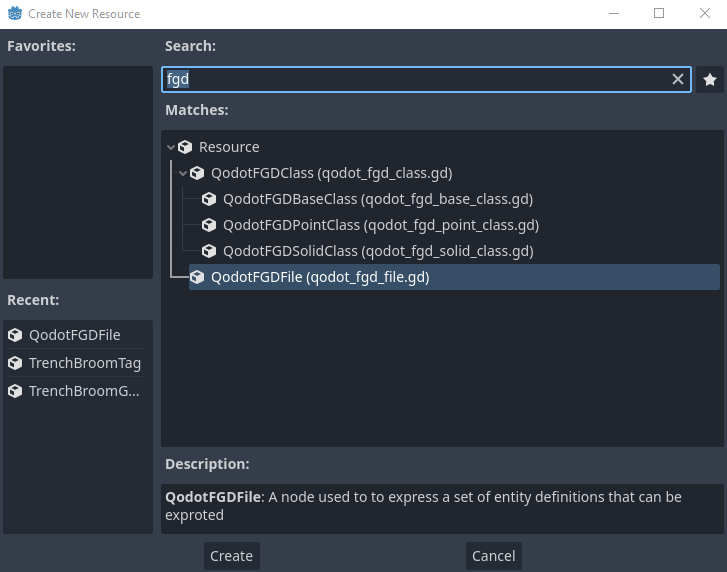

<a href="../readme.md">Home</a> |
<a href="qodot.md">What <i>IS</i> Qodot?</a> | 
<a href="setup.md">Setting Up Your Project</a> | 
<a href="gamemanager.md">The Game Manager Autoload</a> | 
<a href="entities.md">What's an Entity?</a> | 
<a href="baseclass.md">Base Classes and Property Definitions</a> | 
<a href="solidclass.md">Solid Entities</a> | 
<a href="pointclass.md">Point Entities, Part 1</a> | 
<a href="pointclass2.md">Point Entities, Part 2</a> | 
<a href="gameconfig.md">Game Configuration</a> | 
<a href="fgd.md">Forge Game Data</a> | 
<a href="textures.md">Textures!</a> | 
<a href="trenchbroom.md">Finally. TrenchBroom.</a> | 
<a href="qodotmap.md">Building the QodotMap</a> | 
<a href="resources.md">Helpful Resources</a> |
<a href="faq.md">Frequently Asked Qodots</a> 

---

# Forge Game Data

> _FGD stands for "Forge Game Data", leftover from when the Half-Life 2 level editor Hammer used to be the Half-Life 1 editor Worldcraft, and before that when it was a Quake tool called Forge._

<a href="https://book.leveldesignbook.com/appendix/resources/formats/fgd#history"><b>The Level Design Book</b></a> 

If the Game Config file is what tells TrenchBroom about the existence of your game, then the FGD file is what tells TrenchBroom about all of the stuff that's in it.

Let's get started by creating a new **QodotFGDFile** resource in our _res://tb/fgd/_ folder.

 

Now that we have our fresh new FGD resource, let's take a look at all of its properties.

  

- `Export File` : This behaves the same way as the Game Config's _Export_ property, acting more as a button that exports your consolidated FGD resources as a TrenchBroom-compatible FGD file. You can use this to update your FGD file any time you make a change to it instead of GameConfig.

- `Target Folder` : This should be the specific game folder that was created by the Game Config resource (eg: _Trenchbroom/games/Qodot Tutorial/_). Your FGD file will be created in this folder.

- `Fgd Name` : The filename of your FGD, without the extension.

- `Base Fgd Files` : Maybe you want to create separate FGD resources for organization or reusability. This property works just like the _Base Class_ array in our entity definition resources, but for _QodotFGDFile_ resources. Any _Base FGD_ resource you add to this array will be compiled together with this FGD resource, ultimately compiling into one FGD file for TrenchBroom.

- `Entity Definitions` : This is where you will add all of your Base, Solid, and Point Class Entity Definition resources. All of the entity definitions added here will be compiled into the FGD file upon export.

For something so important, the FGD resource is pretty simple and straight-forward. Go ahead and set the _Target Folder_ and _Fgd Name_. We'll skip _Base Fgd Files_ since we only have this one.

Remember all of those entity resources we made for the past 202 chapters? Go ahead and add them to our _Entity Definitions_ array.

When you're done, your FGD resource should look something like this:

> _NOTE: The order of the entity resources does not matter. While the order seen here is the order that Qodot writes them to the FGD, TrenchBroom does not have any issues letting an entity inherit a base class that is defined after it._

### Game Configuration, Part 3

Go back to our Game Config resource, we have one last thing we need to do with it: add our newly created FGD resource to the Game Config's `Fgd Files` array. When you've done that, you should have a GameConfig that, aside from personal naming conventions, looks like this. Go ahead and _Export File_ so that the Game Config now points to our new FGD file.

 

We're almost ready to open up TrenchBroom! But first we have one last thing to go over before we start making our map.

### [**_Next Chapter: Textures! >>>_**](textures.md)

---

<a href="../readme.md">Home</a> |
<a href="qodot.md">What <i>IS</i> Qodot?</a> | 
<a href="setup.md">Setting Up Your Project</a> | 
<a href="gamemanager.md">The Game Manager Autoload</a> | 
<a href="entities.md">What's an Entity?</a> | 
<a href="baseclass.md">Base Classes and Property Definitions</a> | 
<a href="solidclass.md">Solid Entities</a> | 
<a href="pointclass.md">Point Entities, Part 1</a> | 
<a href="pointclass2.md">Point Entities, Part 2</a> | 
<a href="gameconfig.md">Game Configuration</a> | 
<a href="fgd.md">Forge Game Data</a> | 
<a href="textures.md">Textures!</a> | 
<a href="trenchbroom.md">Finally. TrenchBroom.</a> | 
<a href="qodotmap.md">Building the QodotMap</a> | 
<a href="resources.md">Helpful Resources</a> |
<a href="faq.md">Frequently Asked Qodots</a> 

