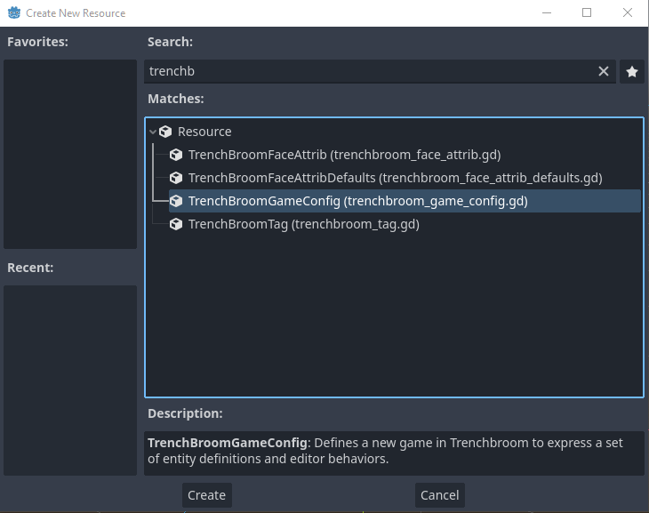
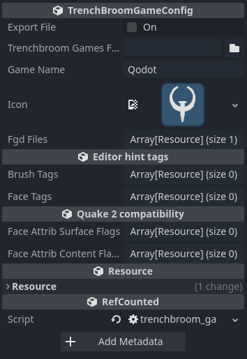
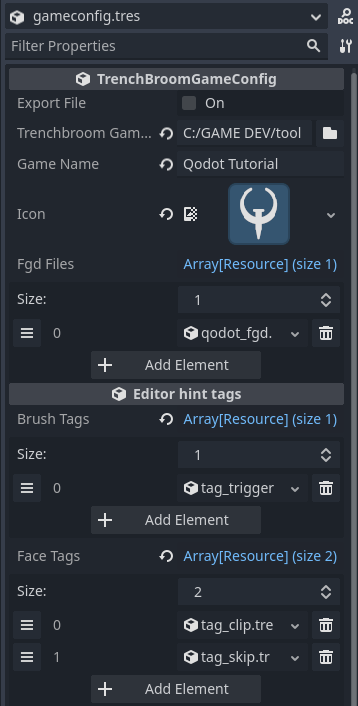

# TrenchBroom Game Configuration

One of the two most important resources we'll need is our **TrenchBroom Game Configuration**. Create a new resource within the _res://tb/fgd/_ folder and choose _TrenchBroomGameConfig_.

 

The TrenchBroom Game Configuration resource defines where TrenchBroom is located and how it understands our game.

  

- `Export` : After everything is set up, press this to export your game configuration. You should only need to do this any time you modify the TrenchBroomGameConfig resource.

- `Trenchbroom Games Folder` : Location of the _games_ sub-directory of your TrenchBroom installation (eg: _C:/TrenchBroom/games/_). This is not your game's unique folder but rather the folder that would contain it. Uses a global path rather than a relative project path.

- `Game Name` : The identifier for your game, usually the game's actual name. This is also the name of the folder that will be created for your game in the _TrenchBroom/games/_ directory.

- `Icon` : Image file that represents your game in TrenchBroom's games list.

- `Fgd Files` : An array of _QodotFGDFile_ resources. This will be exported when you toggle the `Export` property at the top of the resource's properties list. You can also export the FGD through the FGD resource itself.

    > _NOTE: Using more than one FGD resource in this property is currently bugged. Only the first FGD file will be used. If wishing to use multiple FGDs, use the `Base Fgd Files` property in the FGD resource._

- `Brush Tags` : An array of _TrenchBroomTag_ resources. While these tags have no Godot or Qodot import functionality, they do modify certain TrenchBroom brush settings like transparency. Useful for _trigger_ brushes.

- `Face Tags` : An array of _TrenchBroomTag_ resources. This one's for per texture settings, again mostly for transparency. Useful for _clip_ and _skip_ textures.

- `Face Attrib Surface Flags` / `Face Attrib Content Flags` : Currently unused by Qodot.

Select your TrenchBroom games folder and set your game's name and icon. Ignore the FGD files for now. We'll get to that later

## TrenchBroom Tags 

We will be creating 3 new _TrenchBroomTag_ resources in the _res://tb/fgd/tags/_ folder.

 

Name the tag resources as follows: 
- **tag_trigger.tres**
- **tag_clip.tres**
- **tag_skip.tres**

Let's take a look at the TrenchBroom Tag resource and see what's going on with it.

  

- `Tag Name` : This should be a unique name to the other tags.

- `Tag Attributes` : A typed array of Strings. Defaults with "_transparent".

    > _NOTE: TrenchBroom does not recognize "\_transparent" as an attribute, so you must either remove this attribute or rename it to "transparent" without the underscore. Consider this a bug to be fixed in an upcoming patch._

- `Tag Match Type` : The type of TrenchBroom object to apply this tag's attributes to. The only options we're currently interested in are _Texture_ and _Classname_.

- `Tag Pattern` : The pattern for TrenchBroom to filter when applying the Tag Attributes. An asterisk **\*** after the pattern denotes a prefix (_eg: **trigger\*** will filter all entities whose classnames begin with "trigger" like "trigger\_once"_), while placing it before indicates a suffix. If no asterisks are used, then the pattern is taken literally.

- `Texture Name` : If the _Tag Match Type_ is set to _Classname_, an optional texture can be specified. If you use a shortcut command in TrenchBroom to create this type of brush entity, it will automatically be assigned this texture.

The important thing to remember is these tags are purely for the benefit of making things easier for you as a level designer to parse visually, and has no impact on the Qodot import process or the Godot nodes that are created.

For the tag resources we just created, fill them out in a way to match these examples:

 

 

## Game Configuration, Part 2

After we've finished creating our Tags, let's head back to our Game Config resource. We'll want to add our new Tags to the `Brush Tags` and `Face Tags` arrays.

Since `tag_trigger.tres` defines it as a _Classname_ tag type, we'll add it to `Brush Tags`. Both `tag_clip.tres` and `tag_skip.tres` are meant to be applied to any brush faces textured with _clip_ or _skip_, so add both of them to `Face Tags`.

 

Click `Export` and our Game Config resource will create our game folder in the _TrenchBroom/games/_ directory. And with that, our game configuration is done!

Sort of.

While we _could_ use the default example _qodot_fgd.tres_ that comes built-in, we already took all that time to make all of our own entities... so let's instead be the masters of our own fate and create our own **QodotFGDFile** resource from scratch.

### [**_Next Chapter: Making the FGD >>>_**](fgd.md)