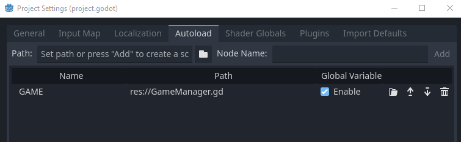

<p align=center>
<a href="../readme.md">Home</a> |
<a href="qodot.md">What <i>IS</i> Qodot?</a> | 
<a href="setup.md">Setting Up Your Project</a> | 
<a href="gamemanager.md">The Game Manager Autoload</a> | 
<a href="entities.md">What's an Entity?</a> | 
<a href="baseclass.md">Base Classes and Property Definitions</a> | 
<a href="solidclass.md">Solid Entities</a> | 
<a href="pointclass.md">Point Entities, Part 1</a> | 
<a href="pointclass2.md">Point Entities, Part 2</a> | 
<a href="gameconfig.md">Game Configuration</a> | 
<a href="fgd.md">Forge Game Data</a> | 
<a href="textures.md">Textures!</a> | 
<a href="trenchbroom.md">Finally. TrenchBroom.</a> | 
<a href="qodotmap.md">Building the QodotMap</a> | 
<a href="resources.md">Helpful Resources</a>
</p>

---

# The Game Manager Autoload

Autoloads are great, globals are great. Just respect their roles and they can become an incredibly useful tool in your game's design and function.

For my games I've created a few functions and design patterns that we can reuse in this tutorial project. These are not the only way to pull off these kinds of features, but I've found they work great with the TrenchBroom to Godot pipeline. Feel free to use and modify them for your own games.

We'll create a new GDScript in our root folder and call it `GameManager.gd`. Copy this code to it:

```gdscript
extends Node
class_name GameManager

# This GDScript 2 function helps reorient Point Entities imported from Trenchbroom via Qodot that utilize the "mangle" key value pair.
# This assumes your entities are intended to be -Z forward as per Godot's position system.
# Light and Info_Intermission entities have special orientations in Trenchbroom. If you utilize those key prefixes
# in your entity classnames, you'll want to specify the other mangle type.
static func demangler(properties: Dictionary, mangle_type: int = 0)->Vector3:
	if properties.has("mangle"):
		var mangle: Vector3 = Vector3.ZERO
		if properties["mangle"] is Vector3:
			mangle = properties["mangle"]
		elif properties["mangle"] is String:
			var arr: Array[String] = (properties["mangle"] as String).split(" ")
			for i in maxi(arr.size(), 3):
				mangle[i] = arr[i].to_float()
		match mangle_type:
			0: mangle = Vector3(mangle.x, mangle.y + 180.0, -mangle.z) # common
			1: mangle = Vector3(mangle.y, mangle.x + 180.0, -mangle.z) # lights
			2: mangle = Vector3(-mangle.x, mangle.y + 180.0, -mangle.z) # info_intermission
		return mangle
	elif properties.has("angle"):
		return Vector3(0.0, (properties["angle"] as float) + 180.0, 0.0)
	return Vector3(0.0, 180.0, 0.0)


# Frequently used method allowing entities to load sounds by String on QodotMap build
static func update_sound(path: String)->AudioStream:
	var snd_path: String = "sounds/" + path
	var s: AudioStream = null
	if snd_path.rfind(".wav") > -1 or snd_path.rfind(".ogg") > -1:
		if FileAccess.file_exists("res://" + snd_path) or FileAccess.file_exists("res://" + snd_path + ".import"):
			s = load("res://" + snd_path)
	return s;

enum Difficulties { EASY, NORMAL, HARD, NIGHTMARE }

var difficulty: int = Difficulties.NORMAL

enum AppearanceFlags {
	NOT_EASY = (1 << 0),
	NOT_NORMAL = (1 << 1),
	NOT_HARD = (1 << 2),
	NOT_NIGHTMARE = (1 << 3)
}

func appearance_check(appearance_flags: int)->bool:
	if appearance_flags & AppearanceFlags.NOT_EASY and difficulty == Difficulties.EASY:
		return true
	if appearance_flags & AppearanceFlags.NOT_NORMAL and difficulty == Difficulties.NORMAL:
		return true
	if appearance_flags & AppearanceFlags.NOT_HARD and difficulty == Difficulties.HARD:
		return true
	if appearance_flags & AppearanceFlags.NOT_NIGHTMARE and difficulty == Difficulties.NIGHTMARE:
		return true
	return false

# Similar setup to Quake, except we can specify multiple targets and a custom target function.
# Targetnames are really Godot Groups, so we can have multiple entities share a common "targetname" in Trenchbroom.
# Additionally, we can comma delimit multiple targetnames to target multiple groups of entities. Neat.
func use_targets(activator: Node)->void:
	if not "properties" in activator:
		return
	var props: Dictionary = activator.properties
	var target_nodes: Array[Node]
	var target_names: PackedStringArray = props.get("target", "").split(",")
	for i in target_names.size():
		target_nodes = get_tree().get_nodes_in_group(target_names[i])
		for tn in target_nodes:
			# Be careful when specifying a function since we can't pass arguments to it (without hackarounds of course)
			var f: String = props.get("targetfunc", "")
			if f != "" and tn.has_method(f):
				tn.call(f)
				continue
			if tn.has_method("use"):
				tn.call("use", activator)
	# Because we can trigger multiple entities at once, we get the trigger message from the caller node only,
	# to prevent spam / missed messages / unpredictable behavior...
	if props.has("message"):
		print(props.message)

# Set the targetnames for the entity. We can specify multiple targetnames using comma delimiting.
func set_targetname(ent: Node, targetname: String)->void:
	if ent != null and targetname != "":
		for t in targetname.split(","):
			if t != "":
				ent.add_to_group(t)
```

There's a lot going on in here. I won't get into the nitty gritty of it, but they should be commented well enough to know what's going on. Let it act as a neat preview of some of the things we'll be covering by the end of this tutorial.

Don't forget to add our new GameManager to our project autoloads! For the purposes of this tutorial, give it the name `GAME`.

<p align=center>

### [**_Next Chapter: What's An Entity? >>>_**](entities.md)

---

<p align=center>
<a href="../readme.md">Home</a> |
<a href="qodot.md">What <i>IS</i> Qodot?</a> | 
<a href="setup.md">Setting Up Your Project</a> | 
<a href="gamemanager.md">The Game Manager Autoload</a> | 
<a href="entities.md">What's an Entity?</a> | 
<a href="baseclass.md">Base Classes and Property Definitions</a> | 
<a href="solidclass.md">Solid Entities</a> | 
<a href="pointclass.md">Point Entities, Part 1</a> | 
<a href="pointclass2.md">Point Entities, Part 2</a> | 
<a href="gameconfig.md">Game Configuration</a> | 
<a href="fgd.md">Forge Game Data</a> | 
<a href="textures.md">Textures!</a> | 
<a href="trenchbroom.md">Finally. TrenchBroom.</a> | 
<a href="qodotmap.md">Building the QodotMap</a> | 
<a href="resources.md">Helpful Resources</a>
</p>