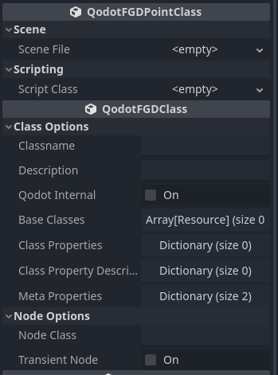

<p align=center>
<a href="../readme.md">Home</a> |
<a href="docs/qodot.md">What _IS_ Qodot?</a> | 
<a href="docs/setup.md">Setting Up Your Project</a> | 
<a href="docs/gamemanager.md">The Game Manager Autoload</a> | 
<a href="docs/entities.md">What's an Entity?</a> | 
<a href="docs/baseclass.md">Base Classes and Property Definitions</a> | 
<a href="docs/solidclass.md">Solid Entities</a> | 
<a href="docs/pointclass.md">Point Entities, Part 1</a> | 
<a href="docs/pointclass2.md">Point Entities, Part 2</a> | 
<a href="docs/gameconfig.md">Game Configuration</a> | 
<a href="docs/fgd.md">Forge Game Data</a> | 
<a href="docs/textures.md">Textures!</a> | 
<a href="docs/trenchbroom.md">Finally. TrenchBroom.</a> | 
<a href="docs/qodotmap.md">Building the QodotMap</a> | 
<a href="docs/resources.md">Helpful Resources</a>
</p>

---

# Point Class Entities, Part 1

Now that we've covered Solid Entities, it's time we learn about the other entity type, **Point Entities**.

Point entities are any entities _not_ constructed from brush work. These are things like player spawn points, enemies, lights, ambient sounds, and more. If it's not created through brush work, it's a point entity.

> _NOTE: **Any** Node Class can be generated by Qodot as a point entity. This includes both non-positional classes like AudioStreamPlayer and CanvasLayer as well as 2D and Control classes like Sprite2D and SubViewportContainer!_

Point entities that have a `position` property will use their `origin` key value pair by Qodot to position them in Godot. 3D entities use all 3 origin vector components divided by a user defined inverse scale factor, while 2D entities will only use the raw X and Y components. When placing 2D entities, make sure to arrange them from the top down view in TrenchBroom. Non-positional entities will still have an origin in TrenchBroom but it will go unused in Godot.

Like their solid counterparts, point entities can also benefit from thoughtful [**naming patterns**](entities.md#naming-patterns). They additionally have a few more meta options built into TrenchBroom that we can take advantage of if we use some more of the same design patterns found in _Quake_. We'll go over those in a bit. For now, let's just set up a couple things.

## Something From Nothing

Qodot has two ways of generating point entities: by specifying a **Node Class** with an optional **Script Class** (just like we did with our [**func_geo**](solidclass.md#back-to-func_geotres)) or through instantiating a **PackedScene**. We'll make a point entity using the method we're already familiar with first.

### Another Base Class

I'm a big fan of base classes. I hope you are, too, because we're creating another one! By now you've probably got the process down. Go ahead and create `mangle_base.tres` in our _res://tb/fgd/base/_ folder. Give it the _Classname_ `Mangle`. We'll only be adding one _Class Property_: `mangle`, with a **Vector3** value. Leave the default value `0 0 0`. In the _Class Property Descriptions_ we'll add our `mangle` entry and give it the description `Entity rotation in degrees.`.

Why "mangle"? In Quake 1, the _mangle_ property was used for specific entities, most commonly **light** entities (to turn them into spotlights). Why didn't they just use _angle_? Well angle was already being used for the spotlight's field of view cone. The other entity that primarily used mangle was **info_intermission**, the intermission camera after the end of each level.

Yes, this is where our Game Manager's **demangler** function comes into play.

### IntermissionCamera

In order to perceive a 3D scene, we need a **Camera3D** node. Normally we'd probably just add it to our Player Character but we don't have one in our project right now. Or maybe you do, but _I_ don't.

We need a camera. We _could_ just add one to our scene, but we're trying to learn how to design our maps entirely in TrenchBroom so let's come up with an entity based solution.

First we'll create a new GDScript in our _res://entities/_ folder and call it `intermission_camera.gd`.

```gdscript
@tool
extends Camera3D

@export var properties: Dictionary :
	set(value):
		properties = value
		if !Engine.is_editor_hint():
			return
		rotation = GameManager.demangler(properties, 2)
	get:
		return properties
```

It's time to make our first point entity! Create a new **QodotFGDPointClass** resource in our _res://tb/fgd/point/_ folder and call it `info_intermission.tres`.

_Wait. Info intermission?_

Yep. I mentioned earlier that TrenchBroom has some built in mechanics to handle certain naming patterns and conventions. One of those is `info_intermission`, where mangle rotations get handled slightly differently. In TrenchBroom, your point entity's orientation is indicated by an arrow offset a little bit outside the center of your entity's origin.

<p align=center>

Technically you don't _have_ to use the info_intermission classname hook. Mangle still affects other entity types too. But if you come from a Quake mapping background and feel more comfortable with this type of mangle handling, it's an option. For the purposes of this tutorial, we will be taking advantage of this.

Let's take a look at our new Point Class resource! I wonder what's different...

<p align=center>

This one's even simpler than [**QodotFGDSolidClass**](solidclass.md#func_geo). The only new property is `Scene File`. As you might've already guessed, this is where we put a **PackedScene** if we want Qodot to instantiate it for this point entity.

Instead let's just set our _Script Class_ to our new `intermission_camera.gd` we just made. Let's make our _Classname_ `info_intermission` and a simple description of `Intermission camera.`. For our _Base Classes_ array, let's toss in ***appearance_base.tres***, ***target_base.tres***, and our new ***mangle_base.tres***. Even with the _Script Class_ we'll still need to tell Qodot what type of _Node Class_ to generate so put in `Camera3D`.

> _NOTE: Node Class strings are **case sensitive**. Make sure to type the class name in exactly as it is in the engine._

<p align=center>

Voila! Our very first **Point Entity**! That wasn't too bad. But there's still a bit more to learn about point entities. Let's do another!

### Do You Hear That?

You should know the drill by now; create `sound_base.tres` in our _res://tb/fgd/base/_ folder. Give it the _Classname_ `Sound`. Add the *appearance_base.tres* and *target_base.tres* to its _Base Classes_ array.

We're not done yet though! We're going to add 2 new _Class Properties_ to our _Sound_ base class: `sound`, which will be a **String** type, and `volume`, a **Float** type with a default value of `1`.

We'll also add some _Class Property Descriptions_ to help remind us and other mappers about what these properties do. Add `sound` and give it the description `File path to sound file, relative to sounds folder.`. Then add `volume` and with the description `Linear volume. Converted to DB on map build.`.

Finally, in our **Meta Properties** we'll change our `color` value to a nice magenta. Our new _Sound_ base class should look something like this now:

<p align=center>

### Sound3D

That's right! We're making a positional sound entity! Let's start by creating a new GDScript called `sound_3d.gd` in our _res://entities_ folder.

```gdscript
@tool
extends AudioStreamPlayer3D
class_name Sound3D

@export var properties: Dictionary :
	set(value):
		properties = value
		if !Engine.is_editor_hint():
			return
		stream = GameManager.update_sound(properties["sound"] as String)
		volume_db = linear_to_db(properties["volume"] as float)
		autoplay = true
	get:
		return properties

func _on_finished():
	GAME.use_targets(self)

func _ready():
	if Engine.is_editor_hint():
		return
	
	if GAME.appearance_check(properties["appearance_flags"] as int):
		queue_free()
		return
	
	GAME.set_targetname(self, properties["targetname"])
	connect("finished", _on_finished)
```

A lot of cool things going on in here: we set the stream to the sound property we wrote to in TrenchBroom, convert our volume property to decibels, and when the node is ready at runtime we check the game's difficulty and filter the entity; if it survives then we apply its targetname and connect the playback so that we can make use of the targeting systems. All very cool stuff.

> _NOTE: Don't forget that the difficulty is currently set to Normal (1) in the GameManager autoload. Do with this knowledge what you wish when the time is right._

Create a new **QodotFGDPointClass** resource and call it `sound_3d.tres`.

The _Classname_ should also be `sound_3d`. For the description, `Positional sound.` works well enough. Drop our `sound_base.tres` into our _Base Class_ array. In our _Meta Properties_ we'll just remove both entries so we can use the _Sound_ base class' _Meta Properties_. Lastly we'll set the _Node Class_ to `AudioStreamPlayer3D`. Make sure to input it exactly like that, with the correct capitalization too.

When you've finished your point class resource should look like this:

<p align=center>

Another one down, and we haven't even broken a sweat. While we could do this as long as Steve Rogers, it's time to take our point entities to the next level.

### [**_Next Chapter: Point Class Entities, Part 2 >>>_**](pointclass2.md)

---

<p align=center>
<a href="../readme.md">Home</a> |
<a href="docs/qodot.md">What _IS_ Qodot?</a> | 
<a href="docs/setup.md">Setting Up Your Project</a> | 
<a href="docs/gamemanager.md">The Game Manager Autoload</a> | 
<a href="docs/entities.md">What's an Entity?</a> | 
<a href="docs/baseclass.md">Base Classes and Property Definitions</a> | 
<a href="docs/solidclass.md">Solid Entities</a> | 
<a href="docs/pointclass.md">Point Entities, Part 1</a> | 
<a href="docs/pointclass2.md">Point Entities, Part 2</a> | 
<a href="docs/gameconfig.md">Game Configuration</a> | 
<a href="docs/fgd.md">Forge Game Data</a> | 
<a href="docs/textures.md">Textures!</a> | 
<a href="docs/trenchbroom.md">Finally. TrenchBroom.</a> | 
<a href="docs/qodotmap.md">Building the QodotMap</a> | 
<a href="docs/resources.md">Helpful Resources</a>
</p>