<p align=center>
<a href="../readme.md">Home</a> |
<a href="qodot.md">What <i>IS</i> Qodot?</a> | 
<a href="setup.md">Setting Up Your Project</a> | 
<a href="gamemanager.md">The Game Manager Autoload</a> | 
<a href="entities.md">What's an Entity?</a> | 
<a href="baseclass.md">Base Classes and Property Definitions</a> | 
<a href="solidclass.md">Solid Entities</a> | 
<a href="pointclass.md">Point Entities, Part 1</a> | 
<a href="pointclass2.md">Point Entities, Part 2</a> | 
<a href="gameconfig.md">Game Configuration</a> | 
<a href="fgd.md">Forge Game Data</a> | 
<a href="textures.md">Textures!</a> | 
<a href="trenchbroom.md">Finally. TrenchBroom.</a> | 
<a href="qodotmap.md">Building the QodotMap</a> | 
<a href="resources.md">Helpful Resources</a> |
<a href="faq.md">Frequently Asked Qodots</a> 
</p>

---

# Point Class Entities, Part 2

## Marsfrog

I want you to meet Marsfrog.

<p align=center>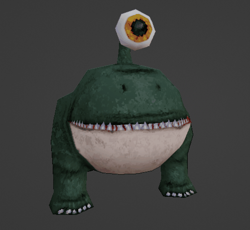

Marsfrog is going to be our pal for this tutorial. He'll teach us how to work with `angle` and `mangle` and `model` and more. Thanks little buddy!

You'll need to download the tutorial assets for this next part. [**Download assets.zip**](../assets.zip), open up **File Explorer** to your project's root directory and extract the contents into there. Just to be safe and make sure everything imports with the proper settings, do ***NOT*** drag and drop them into the Godot Editor.

Let's take a quick look at Marsfrog's GDScript.

```gdscript
@tool
extends Node3D

@export var properties: Dictionary :
	set(value):
		properties = value
		if !Engine.is_editor_hint():
			return
		rotation_degrees = GameManager.demangler(properties)
	get:
		return properties

func use(_activator: Node)->void:
	$marsfrog/AnimationPlayer.play("walk")

func _ready()->void:
	if Engine.is_editor_hint():
		return
	
	if GAME.appearance_check(properties["appearance_flags"] as int):
		queue_free()
		return
	
	GAME.set_targetname(self, properties["targetname"])
```

Just a quick little thing I whipped up for this tutorial. We see the **demangler** function here again. We have a `func use(activator: Node)` method now. If you looked at the Game Manager functions you might have read through the `func use_targets(activator: Node)` method. If not, here's a refresher:

```gdscript
func use_targets(activator: Node)->void:
	if not "properties" in activator:
		return
	var props: Dictionary = activator.properties
	var target_nodes: Array[Node]
	var target_names: PackedStringArray = props.get("target", "").split(",")
	for i in target_names.size():
		target_nodes = get_tree().get_nodes_in_group(target_names[i])
		for tn in target_nodes:
			# Be careful when specifying a function since we can't pass arguments to it (without hackarounds of course)
			var f: String = props.get("targetfunc", "")
			if f != "" and tn.has_method(f):
				tn.call(f)
				continue
			if tn.has_method("use"):
				tn.call("use", activator)
	# Because we can trigger multiple entities at once, we get the trigger message from the caller node only,
	# to prevent spam / missed messages / unpredictable behavior...
	if props.has("message"):
		print(props.message)
```

That's right: any time we get a call for `GAME.use_targets(Node)`, Game Manager looks through the activator's targets and calls the target's `use` method (if it exists). I'm sure there's a dozen little light bulbs turning on in your head right now.

### The Final Base Classes?

_For now..._

The first of the final base classes we'll create is `angle_base.tres`, once again in the _res://tb/fgd/base/_ folder. We'll give it a _Classname_ of `Angle`, adding only one _Class Property_: `angle`, with a **Float** value type. Add one _Class Property Descriptions_ entry for `angle` and give it the description `Entity rotation in degrees.`.

<p align=center>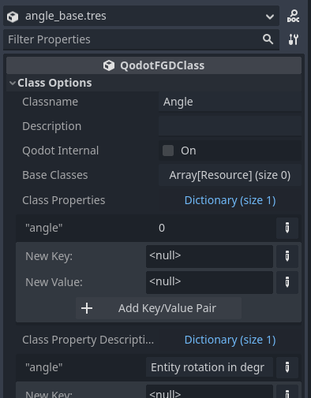

_Why do we have so many base classes with only one property?_

Sometimes we want to reuse a single property across many different types of entities. If we change how that property is expressed for some reason, or we decide a number of related properties should be added to all of the entities that share that first property, this makes it easier to edit and maintain. After this tutorial you may decide a different design pattern works better for your project.

### The Actor Base Class

Marsfrog is what I like to call an _Actor_. Actors can be enemies, they can be allies, they can be neutral parties. The Player is an Actor. That's right, our final base class is `actor_base.tres`.

The _Classname_ should be `Actor`. Add ***appearance_base.tres***, ***target_base.tres***, and ***angle_base.tres*** to the _Base Classes_ array. And just for a bit of fun, let's change the `color` value in _Meta Properties_ to a nice shade of red.

<p align=center>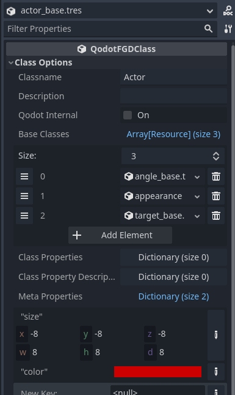

Now we just need to set up our Marsfrog. We already have the scene file all set and ready to go. We just need to create the Point Class resource for it and we'll be all set.

## actor_marsfrog

Like we did for our _func_geo_, we'll make a new folder for our _Actor_ classes in _res://tb/fgd/point_ called `actor`. Create a new **QodotFGDPointClass** resource and call it `actor_marsfrog.tres`.

Instead of a _Script Class_, we'll be providing a **Scene File** this time. Navigate to _res://entities/actor/marsfrog_ and drag **marsfrog.tscn** over to our _Scene File_ property.

Give it the _Classname_ `actor_marsfrog`, and the _Description_ `Little Marsfrog`. We only need to add a single _Base Class_: `actor_base.tres`.

In _Meta Properties_, we'll remove the `color` entry and use the _Actor_ class default instead. Lastly, we'll add the display model, but before we do that we need to go over a few concepts.

### TrenchBroom Display Models

The latest release of TrenchBroom added support for most modern model formats, including **GLTF** / **GLB**. Blender and Godot also offer support for this format. That should make it pretty easy to reuse our models then, right? Well, not exactly.

The first of our problems is illustrated extremely well by this wonderful little chart by [**Freya Holmér**](https://acegikmo.com/):

<p align=center>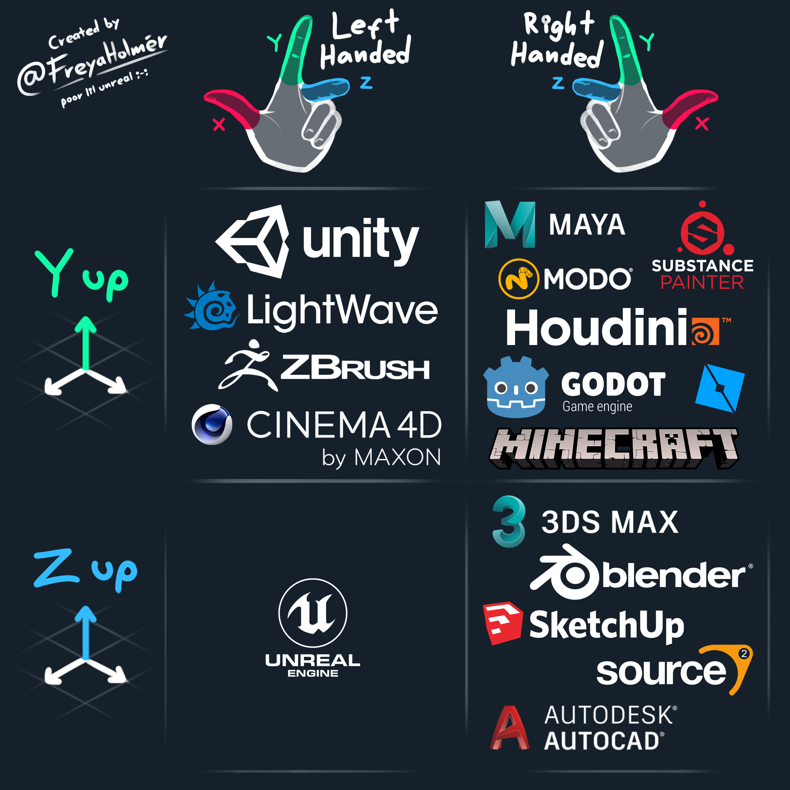</p>

Let's take a look at Marsfrog in the 3 applications that matter to us.

<p align=center>
<b>Blender<br>
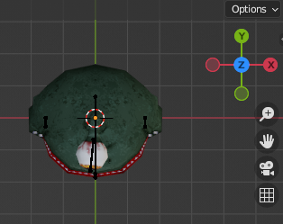<br><br>
Godot<br>
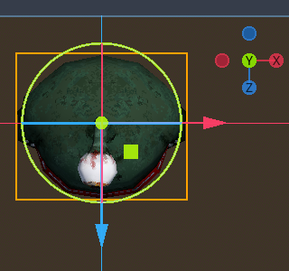<br><br>
TrenchBroom</b><br>
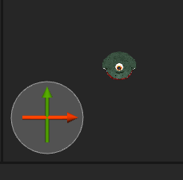<br><br>

_Okay, so that's not too bad, the only outlier is..._

Wait, remember that orientation arrow in TrenchBroom that I mentioned before? Let me just zoom out in that last image there.

<p align=center>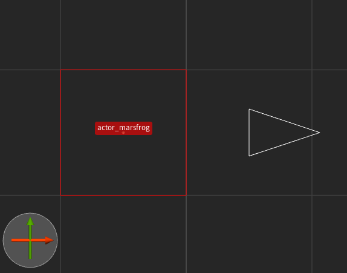<br><br>

Okay, so that's probably an issue.

### Why does this happen?

<p align=center><br>
<a href="https://xkcd.com/927/">xkcd: Standards</a><br>

So the convenient thing about Blender and Godot is that **1 Blender meter == 1 Godot Unit**, and Blender defaults to meters for its unit measurement. Blender also has an option to export GLTF with swapped Y and Z axes, making it trivial to import our Blender models into Godot. Nice.

Our real issue is the orientation and scale in TrenchBroom. TrenchBroom itself was tailored for the Quake Engine (which uses a **+X == Forward** coordinate system) and measures distances in Quake Units, which seems to be more analagous to pixels in an image than to any real world measurement system.

Fortunately, it's an easy fix if you have access to the source models.

### Marsfrog Reorientation

Included with this tutorial is the basic [**Marsfrog blend file**](../marsfrog.blend). While we've already imported the Marsfrog GLTF into Godot we'll still want to see him properly in TrenchBroom to make it easier to map with him. Time to open up Marsfrog.

Upon opening **marsfrog.blend**, we get greeted with our cute friend's portly stature and dumb... grin? I can't tell. In any case, let's get a top down view. It'll make it easier to edit.

<p align=center>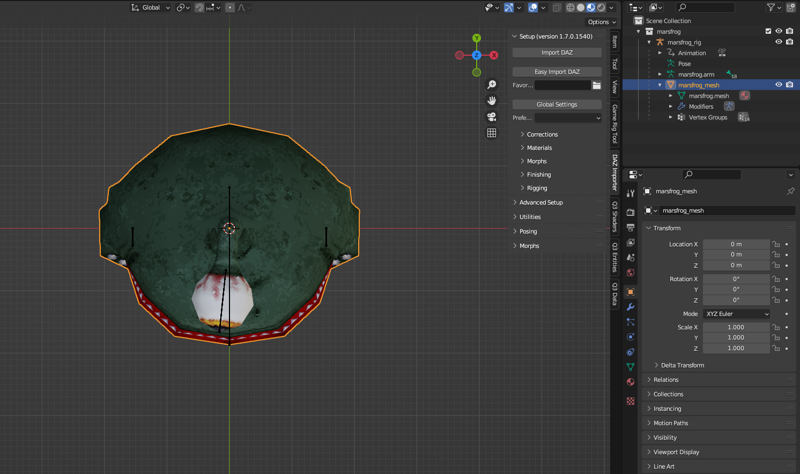

The first thing we'll do is select our mesh and **duplicate** it, so that we don't accidentally destroy our working model.

Make sure the duplicate is selected, then go to the **Modifiers Tab** and find the **Armature Modifier** and apply the modifier. After the armature is applied the modifier should disappear.

<p align=center>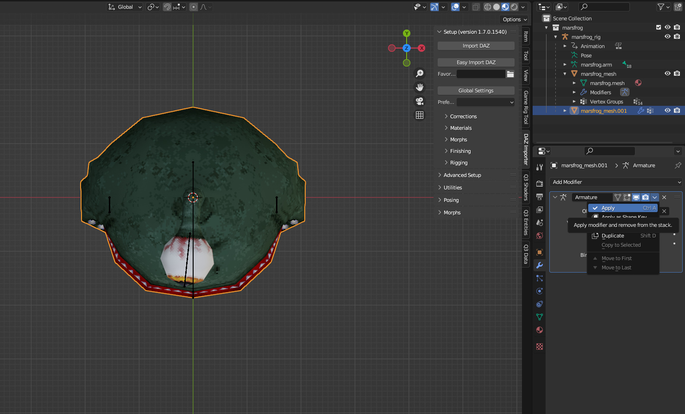

Unparent the duplicate mesh with **Alt + P**. Now you should be free to **rotate** our Marsfrog Clone **-90 degrees**. This will align him properly with the Quake and TrenchBroom coordinate system.

<p align=center>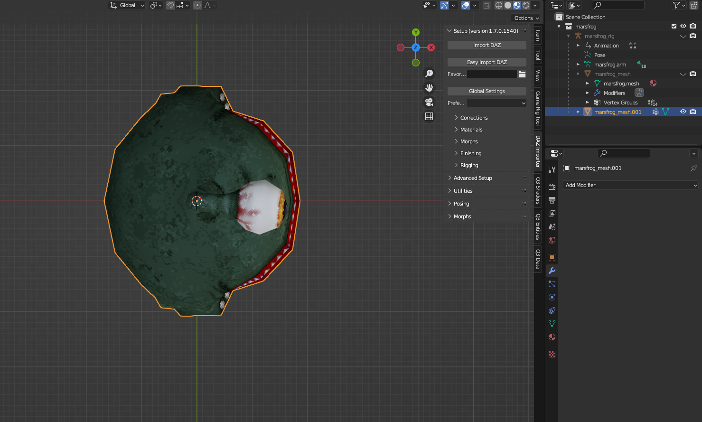

With Marsfrog Clone selected we can now **export to GLB**. I use these settings.

<p align=center>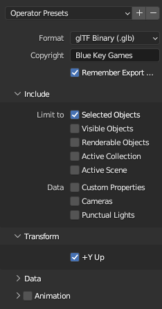

Exporting as a GLB allows us to export our display model as a single file. While it's generally better to use the multi-file GLTF setup for Godot, in TrenchBroom we can take advantage of the GLB single-file format.

Due to the way TrenchBroom displays GLB models we actually do want to keep the `+Y Up` option ticked.

Animations aren't necessary for what we'll be doing, so to keep the filesize as small as possible we'll untick them.

Find your project's ***tb/models/*** folder and export our model as `marsfrog.glb`. And that takes care of all we need to do in Blender! It might seem like a lot of steps due to the format of the tutorial, but it really does just amount to a quick `duplicate the mesh, isolate it, rotate it, export it` process that only takes about a minute or two.

> _NOTE:_ [***make sure there is also a .gdignore file in the tb/models folder***](setup.md#ignore-trenchbroom-models)_. These models are only for TrenchBroom so we don't need to import them into Godot._

### Marsfrog is supposed to be _Little_, not _Microscopic_

So what about the scale? Well, we could have just scaled it in Blender, but by what factor? The problem is we haven't yet decided what Qodot's **Inverse Scale Factor** should be. We haven't even gone over what Qodot's Inverse Scale factor _is_ yet, huh?

Think of it like this: Quake Units are like Pixels. How many pixels does a meter equal out to? 137? 22? The truth is that it's arbitrary; it really depends on what you want the average resolution of your game to be at. Qodot handles this translation through the use of _Inverse Scale Factor_ property on the **QodotMap Node**, a number it uses to divide all of your Quake Unit measurements by when building your map.

Qodot defaults this to **16**, but I've found that if you're going for a 2 meter tall Player Character with Quake 1 structural and texture dimensions, you're better off with an inverse scale of **32**. For the purposes of this tutorial we'll choose 32.

Go back to Godot and our `actor_marsfrog.tres` resource and let's take a look at our _Meta Properties_ again. Every entity comes with a predefined `color` and `size` meta property. For point entities we can define a `model` entry as well.

Here's an example of the point class resource for the Marsdog from _They Came From Dimension X_.

<p align=center>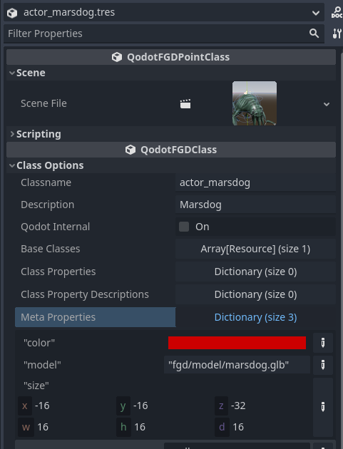

When we export the FGD resource it's added to, we get this output:

```
@PointClass color(204 0 0) model("fgd/model/marsdog.glb") size(-16 -16 -32, 16 16 16) base(Actor) = actor_marsdog : "Marsdog" [
]
```

If our `marsfrog.glb` were scaled up then we could just do the same thing: put in the model path inside quotes and be done with it. But since he's not we'll have to use a TrenchBroom feature called `scale_expression`.

TrenchBroom offers you the ability to set a scale expression in one of two places: the Game Configuration file, or in the FGD on a per-entity basis. Right now we'll explore the per-entity method to better understand how to apply scale expression, then in a later chapter we'll look at the Game Configuration method. In some cases you may wish to take advantage of both at the same time.

First things first though, [**let's see what the TrenchBroom docs have to say on scale expression**](https://trenchbroom.github.io/manual/latest/#display-models-for-entities):

> Each entity definition should contain only one model definition, and the expression in the model definition should evaluate either to a value of type string or to a value of type map. If the expression evaluates to a map, it must have the following structure:
> ```
> {
>    "path" : MODEL,
>    "skin" : SKIN,
>    "frame": FRAME,
>    "scale": SCALE_EXPRESSION
> }
> ```

> ... If the model expression has a scale expression, then its result is used as the scale value for the model. If the expression cannot be evaluated, or if no such expression is given, then the default scale expression from the game configuration is evaluated instead.

So with that in mind, what we want Qodot to output to our FGD file is:

```
model({
    "path" : "models/marsfrog.glb",
    "scale" : 32
})
```

In our Marsfrog resource's _Meta Properties_ we'll add a new entry with the **String** key of `model` and the **String** value `{"path": "models/marsfrog.glb", "scale": 32}`.

> _NOTE: If you choose to set a game-wide scale expression in your Game Configuration resource, setting this entity's scale expression will override the Game Configuration scale._

### Script Class and Node Class

Since we're using a premade _Scene File_, we actually don't need to apply a script to the entity resource. If we do apply a _Script Class_ it should override the script of the root node of the PackedScene, should you want to. As for the _Node Class_, we'll leave that blank since we're already instantiating a specific node setup.

And with that, our first **Scene File Point Class Entity with a TrenchBroom Display Model** is done! Congratulations!

I know, I know, it's tough not seeing the fruits of your labor yet. But don't worry! We're getting close to the finish line now. We finally have a set of entities ready. Now it's time to tell TrenchBroom about our game.

### [**_Next Chapter: TrenchBroom Game Configuration >>>_**](gameconfig.md)

---

<p align=center>
<a href="../readme.md">Home</a> |
<a href="qodot.md">What <i>IS</i> Qodot?</a> | 
<a href="setup.md">Setting Up Your Project</a> | 
<a href="gamemanager.md">The Game Manager Autoload</a> | 
<a href="entities.md">What's an Entity?</a> | 
<a href="baseclass.md">Base Classes and Property Definitions</a> | 
<a href="solidclass.md">Solid Entities</a> | 
<a href="pointclass.md">Point Entities, Part 1</a> | 
<a href="pointclass2.md">Point Entities, Part 2</a> | 
<a href="gameconfig.md">Game Configuration</a> | 
<a href="fgd.md">Forge Game Data</a> | 
<a href="textures.md">Textures!</a> | 
<a href="trenchbroom.md">Finally. TrenchBroom.</a> | 
<a href="qodotmap.md">Building the QodotMap</a> | 
<a href="resources.md">Helpful Resources</a> |
<a href="faq.md">Frequently Asked Qodots</a> 
</p>