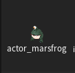

<a href="../readme.md">Home</a> |
<a href="qodot.md">What <i>IS</i> Qodot?</a> | 
<a href="setup.md">Setting Up Your Project</a> | 
<a href="gamemanager.md">The Game Manager Autoload</a> | 
<a href="entities.md">What's an Entity?</a> | 
<a href="baseclass.md">Base Classes and Property Definitions</a> | 
<a href="solidclass.md">Solid Entities</a> | 
<a href="pointclass.md">Point Entities, Part 1</a> | 
<a href="pointclass2.md">Point Entities, Part 2</a> | 
<a href="gameconfig.md">Game Configuration</a> | 
<a href="fgd.md">Forge Game Data</a> | 
<a href="textures.md">Textures!</a> | 
<a href="trenchbroom.md">Finally. TrenchBroom.</a> | 
<a href="qodotmap.md">Building the QodotMap</a> | 
<a href="resources.md">Helpful Resources</a> |
<a href="faq.md">Frequently Asked Qodots</a> 

---

# Building the QodotMap

It's finally time to learn about the centerpiece of the Qodot plugin: **the QodotMap Node**.

Let's create a new scene and add a QodotMap.

There's a lot going on here. We talked about some of these options but let's just go through them all again.

- `Map File` : Fairly obvious: the location of your map file. This takes a Global Path rather than a Project Path. This means you can use a map file located outside of your project.

- `Inverse Scale Factor` : We've mentioned this a couple times in previous chapters. This is the scale ratio between the map's Quake Units to Godot Units, affecting the scale at which your map is built.

- `Entity FGD` : The FGD resource containing the definitions for the entities found in the selected map.

- `Base Texture Dir` : The root folder where Qodot will search for brush texture names. Reread the [**Textures**](textures.md) chapter for more details.

- `Texture File Extensions` : Array of image file extensions to search for when generating materials.

- `Worldspawn Layers` : An array of WorldspawnLayer resources. I don't recommend bothering with WorldspawnLayers since the entity system is more than enough to do all the things we'd use WorldspawnLayers for, and more efficient about it, too.

- `Brush Clip Texture` : This is the location of the first texture Qodot will use for culling mesh faces on build, relative to _Base Texture Dir_. Collision will be retained in both Convex and Concave types.

- `Face Skip Texture` : Location of the second texture Qodot will use for culling mesh faces on build, relative to _Base Texture Dir_. Collision for these faces is currently retained in both Convex and Concave types, but this behavior is currently planned to change in a future update.

- `Texture Wads` : An array of Quake WAD files. This was largely included for Quake map compatibility but not really efficient for serious work flows. Recommend against using.

- `Material File Extension` : When Qodot applies textures on map build it will first look for any premade material resources with this extension before generating a resource. Useful for assigning custom shaders to brushes, like liquid shaders. Reread the [**Textures**](textures.md) chapter for more details.

- `Unshaded` : Quick and dirty unshaded material generation mode. Mostly used to ignore lighting.

- `Default Material` : The template material Qodot generates materials with using the brush textures as albedo. Is also used as the template for automated PBR textures. Reread the [**Textures**](textures.md) chapter for more details.

- `Default Material Albedo Uniform` : If the default material is a ShaderMaterial rather than StandardMaterial3D, this is the shader uniform that provides the albedo texture.

- `UV Unwrap Texel Size` : Texel size for lightmaps. See the [**Godot docs**](https://docs.godotengine.org/en/stable/tutorials/3d/global_illumination/using_lightmap_gi.html#unwrap-on-scene-import-recommended) for more information.

- `Print Profiling Data` : Prints the length to completion of every build step for debugging purposes.

- `Use Trenchbroom Group Hierarchy` :
    > If true, Qodot will build a hierarchy from Trenchbroom groups, each group being a node. Otherwise, Qodot nodes will ignore Trenchbroom groups and have a flat structure.

    It's supposed to take advantage of Solid Entities with the Group spawn type, but it doesn't seem to function properly. Leave unchecked for consistent results.

- `Block Until Complete` : If **true**, stop the Editor until the build is complete.

- `Tree Attach Batched Size` : Unused.

- `Set Owner Batch Size` : How many nodes to set the owner of, or add children of, at once. Higher values may lead to quicker build times, but a less responsive editor.

That's... a lot. We won't really be touching the majority of these to be honest but it's always good to know what you're looking at. Let's get started!

### Preparing for Build

We'll start from the top and work our way down. For now, don't set a _Map File_. We'll come back to it later.

If you'll recall, we opted to set our _Inverse Scale Factor_ to **32**. Make sure we're using the custom _QodtFGDFile_ resource we spent 80 years crafting and not the default.

Our _Base Texture Dir_ should point to ***res://tb/textures/***.

We can ignore _Texture File Extensions_ since it already includes all the formats we'll need, and ignore _Worldspawn Layers_ since we're not using them. Leave _Brush Clip Texture_ and _Face Skip Texture_ alone, as the assets you downloaded already provided them in those locations. Ignore _Texture Wads_ since we won't be using them for this project.

We'll leave _Material File Extension_ alone since the _.tres_ format works well. I leave the decision of _Unshaded_ to you, but I'll be leaving it off. However let's change the _Default Material_ to the one we made during our brief stint in the [**Textures chapter**](textures.md#why-are-my-textures-blurry), `qodot_default.tres`. Since our default material is a StandardMaterial3D we don't need to put anything into _Default Material Albedo Uniform_.

We can ignore the rest of the settings. You should now have a QodotMap node that looks like this.

We are going to save this scene as a template so that we don't have to set this up again for other maps. Go ahead and save the scene in your ***res://maps/*** folder as `mapbase.tscn`.

Any time we want to create a new map, we can either instantiate this scene or duplicate it. For now we'll just go with the latter option. Duplicate the scene file and call it... well, whatever you'd like. How about `marsfrogreturns.tscn`?

 

## Time to Build

In your definitely-named `marsfrogreturns.tscn`, go ahead and give the _QodotMap_ node the location of the map file we made earlier. With the QodotMap selected, at the top of the Editor you should see some buttons.

- **Quick Build** : Quickly builds the map without setting ownership to any nodes. Build does not persist outside of the edited scene and disappears upon testing or closing the scene file. Only intended to give a quick preview.

- **Full Build** : Fully constructs the map and assigns ownership to nodes, allowing them to persist in the scene and be saved.

- **Unwrap UV2** : Unwraps the Worldspawn mesh's UV2 for lightmapping. This does not unwrap anything not merged with Worldspawn. Not to worry though, our [**func_geo script automatically unwraps our UV2 upon build**](solidclass.md#writing-our-func_geogd-script) so we don't have to worry about it.

Go ahead. Perform a **Full Build**.

If you did everything correctly up until this point, you should end up with something like this.

When you test it out you should notice one of the Marsfrogs has _vanished_. This was the one we set the `appearance_flag` to `Not on Normal`. You'll also hear our **Sound3D** play the music cue that came with the assets you downloaded earlier, the one we set by filepath.

Wait a few moments for the music cue to finish playing and the Sound3D will then call Game Manager's `use_targerts` method, triggering the **Marsfrog** to do a little dance while also printing a message in the Output.

> _NOTE: While the Game Manager only calls the Utility Function's `print()` method, you can replace it with any custom UI messaging method or signal to display in-game on-screen text._

***Hello world! Look at little Marsfrog go!***

Incredible work! Congratulations! You've gone from nothing to successfully watching a little Marsfrog dance to the end of a silly music cue, completely mapped out in TrenchBroom!

And that's really all there is to it. Every single entity you will ever make follows these basic design ideas. It may seem a bit overwhelming to some of you, but all it takes is a little bit more practice and familiarity and it will quickly become second nature.

And before you know it, you'll have that `func_door` opening by auto-generated `trigger_volume` in no time at all.

---

<a href="../readme.md">Home</a> |
<a href="qodot.md">What <i>IS</i> Qodot?</a> | 
<a href="setup.md">Setting Up Your Project</a> | 
<a href="gamemanager.md">The Game Manager Autoload</a> | 
<a href="entities.md">What's an Entity?</a> | 
<a href="baseclass.md">Base Classes and Property Definitions</a> | 
<a href="solidclass.md">Solid Entities</a> | 
<a href="pointclass.md">Point Entities, Part 1</a> | 
<a href="pointclass2.md">Point Entities, Part 2</a> | 
<a href="gameconfig.md">Game Configuration</a> | 
<a href="fgd.md">Forge Game Data</a> | 
<a href="textures.md">Textures!</a> | 
<a href="trenchbroom.md">Finally. TrenchBroom.</a> | 
<a href="qodotmap.md">Building the QodotMap</a> | 
<a href="resources.md">Helpful Resources</a> |
<a href="faq.md">Frequently Asked Qodots</a> 

