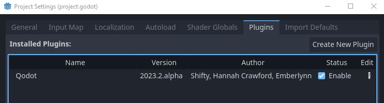
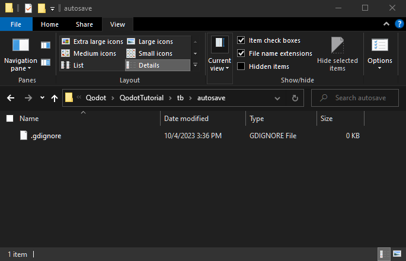

<a href="../readme.md">Home</a> |
<a href="docs/qodot.md">What <i>IS</i> Qodot?</a> | 
<a href="docs/setup.md">Setting Up Your Project</a> | 
<a href="docs/gamemanager.md">The Game Manager Autoload</a> | 
<a href="docs/entities.md">What's an Entity?</a> | 
<a href="docs/baseclass.md">Base Classes and Property Definitions</a> | 
<a href="docs/solidclass.md">Solid Entities</a> | 
<a href="docs/pointclass.md">Point Entities, Part 1</a> | 
<a href="docs/pointclass2.md">Point Entities, Part 2</a> | 
<a href="docs/gameconfig.md">Game Configuration</a> | 
<a href="docs/fgd.md">Forge Game Data</a> | 
<a href="docs/textures.md">Textures!</a> | 
<a href="docs/trenchbroom.md">Finally. TrenchBroom.</a> | 
<a href="docs/qodotmap.md">Building the QodotMap</a> | 
<a href="docs/resources.md">Helpful Resources</a>

---

# Setting Up Your Project

## Installing Qodot

Alright, no time for warm welcomes, I need to teach you the awful secrets behind the universe. First things first, **[you'll need to install Qodot](https://github.com/QodotPlugin/Qodot/)**. Make sure to follow the instructions fully, don't just skim them. Also don't forget to enable Qodot in Project Settings!

 

## Directory Structure

So designing a directory structure for your game is its own art, and the layout of your project files can depend greatly on the kind of game you're making. For the purposes of this tutorial we will be working with an organization that splits our **Godot assets** from our **TrenchBroom resources**.

Set up your project's directory with this structure:

- **res://**
    - **entities**
    - **maps**
    - **sounds**
    - **tb**
        - **autosave**
        - **fgd**
            - **base**
            - **solid**
            - **point**
            - **tags**
        - **models**
        - **textures**

## Autosave
So what's the deal with the _autosave_ folder? Well, TrenchBroom has a handy backup feature where it creates an autosave folder to periodically save backups of your map file. Less useful is the tendency for Godot to import these backups as well.

However, Godot has its own handy feature to combat this. Any directory with a `.gdignore` file will not be scanned and imported by Godot. To save ourselves some headache later, open the **_autosave_** sub-directory in **File Explorer**. Make sure to check under the **View** tab that **File Name Extensions** is enabled. Create a new file in the sub-directory by creating a new **Text Document** and rename it `.gdignore`, exactly like that with the `.txt` extension removed. 

 

And just like that, we won't have to deal with Godot constantly importing hundreds of backup map files from our project! You can do this for any directory that you don't want Godot to import files from.

### Ignore TrenchBroom Models

We'll also want to ignore the contents of our _res://tb/models/_ folder as well, since they'll be used exclusively for TrenchBroom point entities. There are a few reasons we can't just reuse our Godot GLTFs which we'll go over later, but for now just copy the `.gdignore` file you just created into the _res://tb/models/_ folder.

## What's next?

With our directory structure set up, we're going to take a detour from project setup. While you'd think it'd make sense to create our Game Configuration and FGD file next, they're a little useless without some entities to go with them first. However, before we get to that we'll want to implement a common design pattern to help tie our entities together.

### [**_Next Chapter: The Game Manager Autoload >>>_**](gamemanager.md)

---

<a href="../readme.md">Home</a> |
<a href="docs/qodot.md">What <i>IS</i> Qodot?</a> | 
<a href="docs/setup.md">Setting Up Your Project</a> | 
<a href="docs/gamemanager.md">The Game Manager Autoload</a> | 
<a href="docs/entities.md">What's an Entity?</a> | 
<a href="docs/baseclass.md">Base Classes and Property Definitions</a> | 
<a href="docs/solidclass.md">Solid Entities</a> | 
<a href="docs/pointclass.md">Point Entities, Part 1</a> | 
<a href="docs/pointclass2.md">Point Entities, Part 2</a> | 
<a href="docs/gameconfig.md">Game Configuration</a> | 
<a href="docs/fgd.md">Forge Game Data</a> | 
<a href="docs/textures.md">Textures!</a> | 
<a href="docs/trenchbroom.md">Finally. TrenchBroom.</a> | 
<a href="docs/qodotmap.md">Building the QodotMap</a> | 
<a href="docs/resources.md">Helpful Resources</a>

