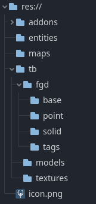

# Setting Up Your Project

## Installing Qodot

Alright, no time for warm welcomes, I need to teach you the awful secrets behind the universe. This tutorial is going to assume that you are familiar with Godot's basics. If you haven't opened up Godot and poked around a bit yet, I'd recommend you do so before getting started with Qodot.
All good now? Great. First things first, though, **[you'll need to install Qodot](https://github.com/QodotPlugin/Qodot/)**. Make sure to follow the instructions fully, don't just skim them. Also don't forget to enable Qodot in Project Settings!

 

## Directory Structure

So designing a directory structure for your game is its own art, and the layout of your project files can depend greatly on the kind of game you're making. For the purposes of this tutorial we will be working with an organization that splits our Godot **Entities** and **Maps** from our **FGD** and **TrenchBroom** resources.

Add the following folders to your project's root directory:

- **entities**
- **maps**
- **tb**

Then create these folders within the _tb_ directory.
- **autosave**
- **fgd**
- **models**
- **textures**

Finally, create these folders within the _tb/fgd_ sub-directory:
- **base**
- **solid**
- **point**
- **tags**

You should now have a directory structure that looks like this: 

 

## Autosave 
So what's the deal with the _autosave_ folder? Well, TrenchBroom has a handy backup feature where it creates an autosave folder where it periodically saves backups of your map file. Less useful is the tendency for Godot to import these backups as well.

However, Godot has a handy feature to combat this. Any directory with a `.gdignore` file will not be scanned and imported by Godot. To save ourselves some headache later, open the **_autosave_** sub-directory in **File Explorer**. Make sure to check under the **View** tab that **File Name Extensions** is enabled. Create a new file in the sub-directory by right clicking, selecting **New**, and selecting **Text Document**. Rename the newly created file `.gdignore`, exactly like that with the `.txt` extension removed. 

 

And just like that, we won't have to deal with Godot constantly importing hundreds of backup map files from our project! You can do this for any directory that you don't want Godot to import files from.

## What's next?

With our directory structure set up, we're going to take a detour from project setup. While you'd think it'd make sense to create our Game Configuration and FGD file next, they're a little useless without some entities to go with them first.

### [**_Next Chapter: What's An Entity? >>>_**](fgd.md)