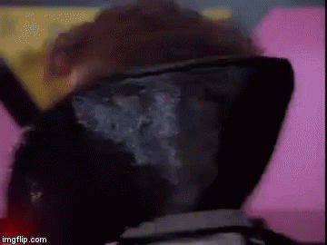
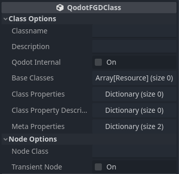
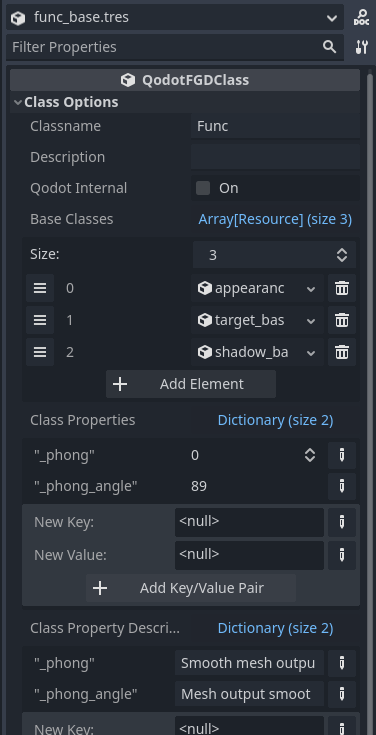
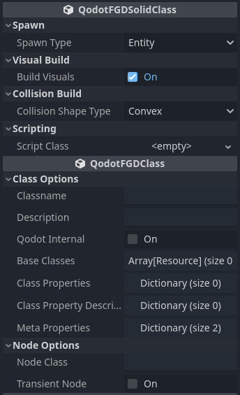
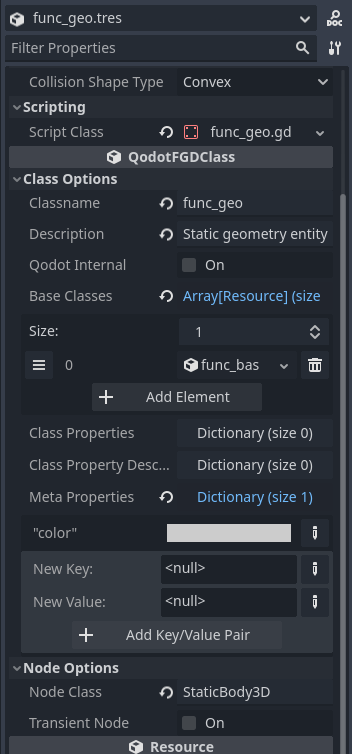

<p align=center>
<a href="../readme.md">Home</a> |
<a href="qodot.md">What <i>IS</i> Qodot?</a> | 
<a href="setup.md">Setting Up Your Project</a> | 
<a href="gamemanager.md">The Game Manager Autoload</a> | 
<a href="entities.md">What's an Entity?</a> | 
<a href="baseclass.md">Base Classes and Property Definitions</a> | 
<a href="solidclass.md">Solid Entities</a> | 
<a href="pointclass.md">Point Entities, Part 1</a> | 
<a href="pointclass2.md">Point Entities, Part 2</a> | 
<a href="gameconfig.md">Game Configuration</a> | 
<a href="fgd.md">Forge Game Data</a> | 
<a href="textures.md">Textures!</a> | 
<a href="trenchbroom.md">Finally. TrenchBroom.</a> | 
<a href="qodotmap.md">Building the QodotMap</a> | 
<a href="resources.md">Helpful Resources</a>
</p>

---

# Solid Entities

Qodot refers to any entity constructed with brush work as a **Solid Entity**. It isn't entirely accurate to call them _solid_ since we don't actually need to provide these entities with collision. We also don't need to provide these entities with meshes from the brush work either. This is cool, because it means we have a lot of flexibility in how to construct our maps.

TrenchBroom refers to these entity types as **Brush Entities**. If you'll recall, TrenchBroom can render these types of entities in specific ways based upon their [**naming conventions**](entities.md#naming-patterns) and the [**tags we define in our GameConfig**](gameconfig.md#trenchbroom-tags).

Solid Entities can be map geometry, breakable walls, doors and lifts, floating platforms, buttons, trigger volumes, occlusion polygons... pretty much anything you might want to construct out of brush geometry.

## Worldspawn

As mentioned before, Qodot comes with a set of example Entity Definitions, including one for the _worldspawn_ class that comes built-in to every map file. But what _is_ **worldspawn**?

Every Quake map file contains a list of entities containing a set of key value pairs. Some optionally include brush definitions. In Quake, the entity's `classname` is also the spawn function that is called upon map start. The very first entity that needs to load is the world, so entity 0 is always `worldspawn`. There can also only ever be one Worldspawn in a Quake map (with one weird exception I'll mention later).

Simply put, Worldspawn is just another entity. It's not even a Solid Entity by default. It needs to be defined in your FGD just like any other entity, too, or else it will revert to a simple _QodotEntity_ class with a mesh and no collision. The only special behavior Worldspawn has is that its position will _always_ be `0 0 0`, unlike other Solid Entities.

The example Worldspawn entity is defined as a Solid Class StaticBody3D with convex collision, and the general understanding is that it's a built in mechanic of Qodot. I personally find worldspawn a little useless in the Godot environment, so I opted to change it into a [**WorldEnvironment that instantiates a LightmapGI**](entities.md#key-value-pairs-and-the-properties-dictionary) that also handles default music playback and other map-wide settings. You might think of a completely different use case for it.

> _NOTE: Setting Worldspawn as a Point Class may have undefined side effects due to being able to place a 2nd Worldspawn in your map. It is recommended that any Worldspawn definition be a Solid Class._

If you wish to use the pre-existing Worldspawn (or any other pre-existing example entity) as a base, make sure to copy it out of the `addons` directory and into your project's _res://tb/fgd/_ directory. If you update Qodot, it will overwrite any changes you made to the example entities, potentially breaking your game.

### WorldspawnLayers

The official example scene for them has a readme node that describes WorldspawnLayers as this:

> In Quake, there are certain textures that apply special behavior or properties to brushes, such as water, slime, and lava. Worldspawn layers are the Qodot equivalent - scriptable volumes defined by a texture that don't have a FGD entry or properties as an entity would.
> 
> Worldspawn layers are defined as a `Resource` subclass in Godot, and are plugged into the `Worldspawn Layers` property of QodotMap in order to supply the requisite information to the build system. You can define their name, texture, visual build, collision type, and associated script in order to implement custom behavior.

Honestly, with the strength of the entities system this feature seems superfluous. The WorldspawnLayer system always felt more like a misguided method to try to shoehorn an aspect of Quake workflow into Godot after already having an entity system in place that works far better with far more flexibility. Additionally, the feature seems to be a little busted in the Godot 4 version of Qodot.

In any case, we won't be using WorldspawnLayers or even Worldspawn for our project.

### Why Not Worldspawn?

Performance on larger or heavily populated maps mostly. Godot culls objects by the VisualInstance; in the case of our maps, this means mesh by mesh. In order to get better performance we'll need to split our map up into smaller chunks.

Meshes are generated on a per-entity basis: every brush in a Solid Entity is merged into a single mesh. Since Worldspawn is an entity, any brush that is a part of Worldspawn gets merged into the same mesh. If we want to split up our mesh, we need to split our Worldspawn into separate entities.

## func_group

In Quake mapping, **func_group** entities aren't actually real entities, at least not in-engine. Instead, when they get compiled into a BSP the brushes get merged into the Worldspawn and the func_group entities are destroyed. In TrenchBroom you can create these func_groups with a quick input of Ctrl+G. The purpose of func_group in traditional Quake mapping is to provide an easier way to manage and edit your levels by grouping brushes together for easy selection.

To Qodot, _func_group_ is just another Solid Class entity and obeys all the same rules as one. Like any other entity, it needs to be defined or else it will just resort to the default behavior: instantiate a QodotEntity node and generate a MeshInstance3D from its brush definitions. It will always be located in the correct position however.

The current consensus seems to be "use groups to split geometry" and while that seems convenient enough, we can do one better and create our own more flexible geometry entity.

## What the Func?!

So, gonna be honest, I don't know why id Software prefixed most brush entities with `func_`. I asked on Twitter though, so I'll update this bit if I get an answer.

In any case, we'll be keeping up with the long tradition of `func_wall`, `func_door`, and `func_button`... with our very own `func_geo`.

But first! A base class!

_Another one!?_

<p align=center><br>

But we'll be doing something new with this base class. Create another QodotFGDBaseClass resource in the _res://tb/fgd/base/_ directory and call it `func_base.tres`. Give it the classname `Func`. Let's look at the base class resource properties again.

<p align=center><br><br>

If you'll remember, we have a `Base Classes` Array property. This is where you'll add all of the previous base classes we had made earlier: *appearance_base.tres*, *target_base.tres*, and *shadow_base.tres*. After that we'll add 2 new properties: `_phong` with an **Integer** value type, and `_phong_angle` with a **Float** value type. For their _Class Property Descriptions_ we'll provide `_phong` with `Smooth mesh output.` and `_phong_angle` with `Mesh output smoothing angle.`.

> _NOTE: Qodot can utilize certain built-in key values to change build procedures. I won't get too in-depth with an explanation, but [**you can check out the GeoGenerator code**](https://github.com/QodotPlugin/Qodot/blob/df796a889fe1407b5c9cc7a6771379926df98161/addons/qodot/src/core/GeoGenerator.cs#L196) yourself to see how Qodot uses `_phong` and `_phong_angle`._

Our new Func base class should look like this now.

<p align=center><br>

Now that we have our func base class, it's time to make our first real entity.

## func_geo

Create a new **QodotFGDSolidClass** resource in our _res://tb/fgd/solid/_ folder and call it ***func_geo.tres***. Taking a look at our new Solid Class definition resource, we might recognize a few properties while being introduced to some new ones.

<p align=center><br>

- `Spawn Type` : This determines how Qodot generates both the mesh and the collision in regards to vertice positioning and combining.
    - **Worldspawn** : Builds the geometry of this entity without regard to its center position. Upon build completion all geometry will be offset by this entity's true position. Only use with _worldspawn_ entity.

    - **Merge Worldspawn** : This entity's geometry is merged with the _worldspawn_ entity and this entity is removed. Behavior mimics *func_group* in modern Quake compilers (do not confuse with Qodot's func_group example entity).

    - **Entity** : This entity is built as its own object. It finds the center of the entity by averaging the positions of all vertices, using the global result of this as its position. <br>*NOTE: This is not always the center of the mesh's AABB.*

    - **Group** : When the _QodotMap_ node's `Use Trenchbroom Group Hierarchy` boolean is enabled this entity is supposed to have some special type of node generation and parenting behavior, but it seems to be buggy. With the default settings this behaves similarly to the _Entity_ spawn type. Recommend using _Entity_ instead for more consistent results.

- `Build Visuals` : Tells Qodot whether to generate a MeshInstance3D for this entity. Can be useful for things like trigger or hurt volumes.

- `Collision Build` : Tells Qodot how the collision should be built for this entity.
    - **None** : Will not build collision. Can be useful for things like details, decorations, foliage... Commonly used for *func_illusionary* types of entities.

    - **Convex** : Qodot will generate identical CollisionShape3D nodes for each brush in this entity. This ignores mesh face culling by _clip_ and _skip_ textures.

    - **Concave** : Qodot will generate a single concave CollisionShape3D node. This currently ignores mesh face culling by _clip_ and _skip_. In the future it will only ignore culling by _clip_ while removing _skip_ faces from the final collision.

- `Script Class` : The GD or C# script to apply to this entity.

The remaining Solid Class properties are all the familiar ones we saw from the [**QodotFGDBaseClass**](baseclass.md#the-entity-base-class) resource.

We'll start from the top and make sure our _Spawn Type_ is set to `Entity`. We'll leave _Build Visuals_ on. For the _Collision Build_ I'll leave this up to you. I personally use **Concave** collision for my static geometry, [**but you may want to educate yourself on the pros and cons of both**](https://docs.godotengine.org/en/stable/tutorials/physics/collision_shapes_3d.html#convex-collision-shapes).

### Writing our func_geo.gd Script

I've prepared a simple script for our *func_geo*. It doesn't do a lot, but it does enough to learn from. I recommend creating a new folder called ***func*** in your _res://entities_ folder. In your new folder, create a `func_geo.gd` script and copy the code below into it.

```gdscript
@tool
extends StaticBody3D
class_name FuncGeo

const INVERSE_SCALE: float = 1.0 / 32.0

@export var properties: Dictionary = {} :
	set(value):
		properties = value;
		
		if !Engine.is_editor_hint():
			return
		
		for child in get_children():
			if child.get_class() == "MeshInstance3D":
				var m: MeshInstance3D = child
				m.set_gi_mode(GeometryInstance3D.GI_MODE_STATIC);
				m.set_cast_shadows_setting((properties["cast_shadow"] as GeometryInstance3D.ShadowCastingSetting))
				if get_parent() is QodotMap and m.mesh.get_class() == "ArrayMesh":
					(m.mesh as ArrayMesh).lightmap_unwrap(Transform3D(), (get_parent() as QodotMap).inverse_scale_factor)
	get:
		return properties
```

First thing you should notice is that we've set it to be a `@tool` script. This is important because otherwise Qodot would not be able to apply the properties to our entity. As mentioned before, we `@export var properties` and provide both a **set** and **get** to it. When Qodot applies the properties to the entity it can then run the **set** function, allowing us to modify the entity at build time.

When modifying entities and accessing others, it's important to know when a Node will be built and in what order, and to recognize when you cannot know this. With that knowledge we can modifying any entity in the map when we build it, as long as it exists when we ask for it. The `call_deferred` function comes in handy for this, [**as demonstrated in an earlier chapter**](entities.md#key-value-pairs-and-the-properties-dictionary).

Qodot will wait until the node is *ready* to set its `properties` dictionary, meaning all of its children will already be available in the SceneTree. That means we can modify any of this entity's children right away, no deferred calls required.

Only for this entity's ***siblings*** must you use deferred function calls, since we cannot know if they will exist when we ask for them.

Looking back to our script, we can see we set our `properties`, _then_ check to see if we're in editor or runtime with `in !Engine.is_editor_hint()`. This is important because the Godot Engine initializes each node with its default property values, only setting them to the modified ones afterwards. If we return our function before that, we never apply the modified properties at runtime.

As for the editor hint check, we use that to make sure that our entity modifications only apply at build time. Certain changes persist upon saving the scene, and we don't want to apply them again at runtime.

Looking further... do you see it? Yes, right there! We're accessing one of our properties!

```gdscript
m.set_cast_shadows_setting((properties["cast_shadow"] as GeometryInstance3D.ShadowCastingSetting))
```

That's right: all we need to do to access our TrenchBroom key value pairs is just fetch them from our `properties` dictionary. In some cases you may want to type out your types rather than let Godot guess or infer in order to improve performance, but that's really the gist of it.

I know, I know... we're not using our `appearance_flags` or _Target_ base class properties. That's okay, the procedure for accessing them is the same.

That last bit is just a convenience bit where we automatically unwrap our mesh's UV2 for lightmapping purposes.

### Back to func_geo.tres

Now that we have our script, let's set it to our _Script Class_ property. Following that, we'll set our _Classname_ to `func_geo` and give it the _Description_ `Static geometry entity.`.

The next property we're interested in is the _Base Classes_ array. Remember our ***func_base.tres***? Go ahead and put that in our func_geo's Base Classes. Like the Func base class, our func_geo will inherit all of the same base classes now.

Solid entities are not allowed to have a `size` for their metadata, but every QodotFGDClass has one included. This only generates an error message in TrenchBroom and is otherwise benign, but we may as well get rid of it anyway. Open up the _Meta Properties_ group and remove the `size` entry. Fortunately we don't need to worry about doing this for our base classes as the size property is not inherited by solid entities.

> _NOTE: I have already made a [**pull request**](https://github.com/QodotPlugin/Qodot/pull/94) to patch in a fix for this so we don't have to care in the future about it. For now, just continue remembering to remove the `size` entry from your Solid Entities._

Finally, the last piece of the puzzle: the _Node Class_ property. We use this to determine what Node type Qodot will generate on build. We'll set this to `StaticBody3D`.

> _NOTE: If you choose a Node Class that doesn't inherit from **CollisionObject3D** the collision shapes may not generate!_

And with that our new **func_geo** entity is done!

<p align=center>

_So now we're ready to build some maps, yeah!?_

No.

### [**_Next Chapter: Point Class Entities, Part 1 >>>_**](pointclass.md)

---

<p align=center>
<a href="../readme.md">Home</a> |
<a href="qodot.md">What <i>IS</i> Qodot?</a> | 
<a href="setup.md">Setting Up Your Project</a> | 
<a href="gamemanager.md">The Game Manager Autoload</a> | 
<a href="entities.md">What's an Entity?</a> | 
<a href="baseclass.md">Base Classes and Property Definitions</a> | 
<a href="solidclass.md">Solid Entities</a> | 
<a href="pointclass.md">Point Entities, Part 1</a> | 
<a href="pointclass2.md">Point Entities, Part 2</a> | 
<a href="gameconfig.md">Game Configuration</a> | 
<a href="fgd.md">Forge Game Data</a> | 
<a href="textures.md">Textures!</a> | 
<a href="trenchbroom.md">Finally. TrenchBroom.</a> | 
<a href="qodotmap.md">Building the QodotMap</a> | 
<a href="resources.md">Helpful Resources</a>
</p>