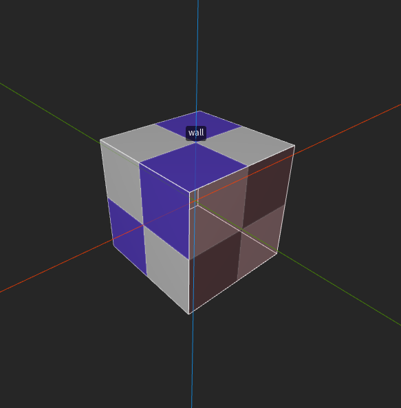
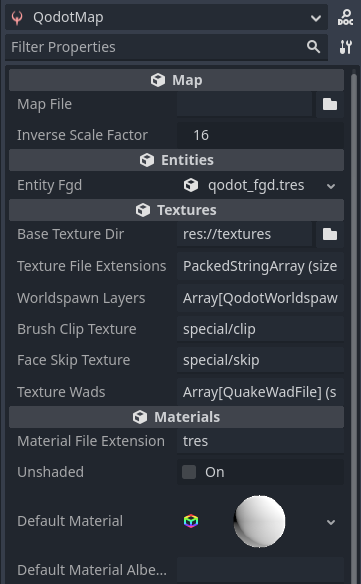

<p align=center>
<a href="../readme.md">Home</a> |
<a href="docs/qodot.md">What _IS_ Qodot?</a> | 
<a href="docs/setup.md">Setting Up Your Project</a> | 
<a href="docs/gamemanager.md">The Game Manager Autoload</a> | 
<a href="docs/entities.md">What's an Entity?</a> | 
<a href="docs/baseclass.md">Base Classes and Property Definitions</a> | 
<a href="docs/solidclass.md">Solid Entities</a> | 
<a href="docs/pointclass.md">Point Entities, Part 1</a> | 
<a href="docs/pointclass2.md">Point Entities, Part 2</a> | 
<a href="docs/gameconfig.md">Game Configuration</a> | 
<a href="docs/fgd.md">Forge Game Data</a> | 
<a href="docs/textures.md">Textures!</a> | 
<a href="docs/trenchbroom.md">Finally. TrenchBroom.</a> | 
<a href="docs/qodotmap.md">Building the QodotMap</a> | 
<a href="docs/resources.md">Helpful Resources</a>
</p>

---

# Textures!

It may seem weird that we're only just now getting to Textures in the 9th inning, but we've been ordering our operations by inheritance so far and the only things that need to know about our textures are TrenchBroom and the QodotMap node.

### How Textures Work In Qodot

If you take a look at a _.map_ file, you'll see that it's just a text file describing the makeup of your map and doesn't actually store any other data, including texture images. Let's look at this example of a **Solid Entity** in a map file:<br>

<p align=center><br>

```
// entity 1
{
"classname" "wall"
// brush 0
{
( -32 0 -16 ) ( -32 1 -16 ) ( -32 0 -15 ) special/clip [ 0 -1 0 0 ] [ 0 0 -1 0 ] 0 1 1
( 0 -32 -16 ) ( 0 -32 -15 ) ( 1 -32 -16 ) special/clip [ 1 0 0 0 ] [ 0 0 -1 0 ] 0 1 1
( 0 0 -32 ) ( 1 0 -32 ) ( 0 1 -32 ) base/checkerboard [ -1 0 0 0 ] [ 0 -1 0 0 ] 0 1 1
( 128 128 32 ) ( 128 129 32 ) ( 129 128 32 ) base/checkerboard [ 1 0 0 0 ] [ 0 -1 0 0 ] 0 1 1
( 128 32 16 ) ( 129 32 16 ) ( 128 32 17 ) special/clip [ -1 0 0 0 ] [ 0 0 -1 0 ] 0 1 1
( 32 128 16 ) ( 32 128 17 ) ( 32 129 16 ) base/checkerboard [ 0 1 0 0 ] [ 0 0 -1 0 ] 0 1 1
}
}
```

This is a `wall` entity from the built-in example `Qodot.fgd`. As you can see, the map file structure is pretty straight-forward. This particular map uses the Valve 220 format, having additional options for UV mapping. Each line in a brush definition describes a face on the brush, and within that you can see that our texture is defined as just its location relative to the game's texture folder or map's WAD file.

_But if that's the case, how does Qodot know what file to use?_<br>
QodotMap nodes have several properties that help define and apply textures to your meshes on build:

- `Base Texture Dir` : Root folder where your Godot map textures are located

- `Texture File Extensions` : The extensions to search for if no matching material is found

- `Texture Wads` : Array of WAD resources to search through

- `Material File Extension` : Format for custom texture materials, can be _.tres_, _.res_ or _.material_

- `Default Material` : The default material that Qodot builds your map's materials from

- `Default Material Albedo Uniform` : If the default material is a ShaderMaterial rather than StandardMaterial3D, this is the shader uniform that provides the albedo texture

<br>

<p align=center><br>

Qodot's first step is to search the `Base Texture Dir` for a prebuilt material as defined by the brush face's texture name in the format defined by `Material File Extension`.

If it does not find this prebuilt material, it will search the `Base Texture Dir` for the _Texture2D_ resource by the brush face's texture name using any one of the extensions defined by `Texture File Extensions`. If it finds the Texture2D, it will create a copy of the `Default Material` and apply the Texture2D as the duplicated material's albedo.

Qodot also has a method to [**automatically build PBR materials**](https://qodotplugin.github.io/docs/materials.html#automatic-pbr-texturing) if your textures are organized a specific way, but that's outside the scope of this tutorial.

_What about WADs?_<br>
I dunno, I don't use them and I don't recommend you use them either.

_What if I really want to use WADs?_<br>
Good luck!

The neat thing about how Qodot handles map textures is that we can technically use a completely different folder in TrenchBroom and even different image formats than the location and formats we keep them in Godot. This can be useful for advanced users, but for now we'll keep both our TrenchBroom textures and our Godot map textures unified.

## _Why Are My Textures Blurry!?_

I mentioned previously that QodotMap nodes use a _Default Material_ as a base material to apply our textures as albedo to. You can and should override the built-in default with your own.

The built-in default uses **Linear Mip-map Sampling**, which means each pixel of the texture will smoothly interpolate to each value. On larger textures and smaller inverse scale factors this isn't a problem, but for those of you trying to create a crunchy retro look this can be undesirable.

Create a new **StandardMaterial3D** resource in the _res://tb/textures/_ folder and call it `qodot_default.tres`. You can customize this however you'd like: this will be the base that a QodotMap with this set on it will use to create materials out of your textures.

The important setting to get that crunchy pixellated look is **Sampling**. Change this to **Nearest** or **Nearest Mip-map** and stop opening issues for it on the Qodot GitHub.

We'll go over setting the _Default Material_ again in 2 chapters, but first I have an important announcement to make.

### [**_Next Chapter: Finally. TrenchBroom. >>>_**](trenchbroom.md)

---

<p align=center>
<a href="../readme.md">Home</a> |
<a href="docs/qodot.md">What _IS_ Qodot?</a> | 
<a href="docs/setup.md">Setting Up Your Project</a> | 
<a href="docs/gamemanager.md">The Game Manager Autoload</a> | 
<a href="docs/entities.md">What's an Entity?</a> | 
<a href="docs/baseclass.md">Base Classes and Property Definitions</a> | 
<a href="docs/solidclass.md">Solid Entities</a> | 
<a href="docs/pointclass.md">Point Entities, Part 1</a> | 
<a href="docs/pointclass2.md">Point Entities, Part 2</a> | 
<a href="docs/gameconfig.md">Game Configuration</a> | 
<a href="docs/fgd.md">Forge Game Data</a> | 
<a href="docs/textures.md">Textures!</a> | 
<a href="docs/trenchbroom.md">Finally. TrenchBroom.</a> | 
<a href="docs/qodotmap.md">Building the QodotMap</a> | 
<a href="docs/resources.md">Helpful Resources</a>
</p>