

<a href="../readme.md">Home</a> |
<a href="qodot.md">What <i>IS</i> Qodot?</a> | 
<a href="setup.md">Setting Up Your Project</a> | 
<a href="gamemanager.md">The Game Manager Autoload</a> | 
<a href="entities.md">What's an Entity?</a> | 
<a href="baseclass.md">Base Classes and Property Definitions</a> | 
<a href="solidclass.md">Solid Entities</a> | 
<a href="pointclass.md">Point Entities, Part 1</a> | 
<a href="pointclass2.md">Point Entities, Part 2</a> | 
<a href="gameconfig.md">Game Configuration</a> | 
<a href="fgd.md">Forge Game Data</a> | 
<a href="textures.md">Textures!</a> | 
<a href="trenchbroom.md">Finally. TrenchBroom.</a> | 
<a href="qodotmap.md">Building the QodotMap</a> | 
<a href="resources.md">Helpful Resources</a>

---

# Finally. TrenchBroom.

We're almost there! We only have one step (no, really) before we can start making maps. Let's open up **TrenchBroom** real quick and create a **New Map**.

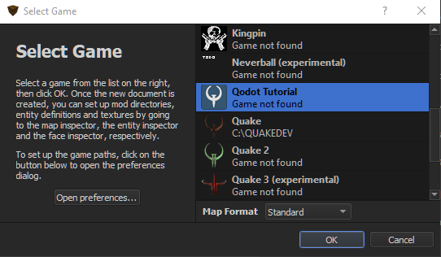 

Whoa! Game not found! That's okay though, we can fix that. Open up preferences. Remember the _tb_ directory we made for our FGD files and map textures? Well that's what we'll be using as our Game Path in our TrenchBroom preferences.

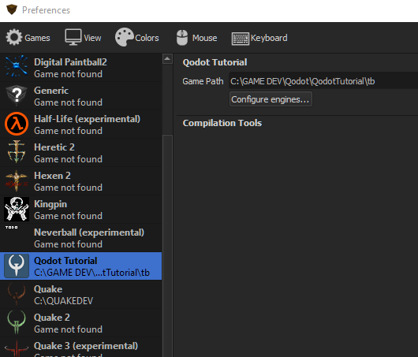 

And with a quick click of _Apply_, we're finally ready to start mapping! Go ahead and create that New Map! Ignore the error about the Marsfrog model. I don't know exactly what causes it, but it doesn't cause us any problems. Instead, go check out the **Entities** tab in the sidebar.

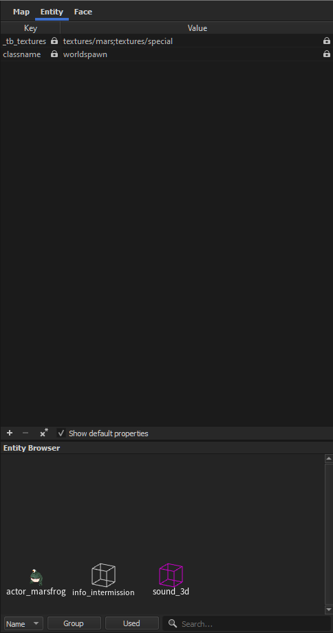 

The first thing you'll notice is that our `worldspawn` doesn't have any properties. This is because we never defined a worldspawn entity. If we did define one, we would see properties there much like the ones we saw in [**the Worldspawn example**](entities.md#key-value-pairs-and-the-properties-dictionary) so many millennia ago.

The next thing you most definitely noticed was 3 of our entities just hanging out in the _Entity Browser_. Oh man, there's Marsfrog!

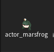 

## Mapping For ~~Quake~~ Godot

At the very beginning of all this I made the point that [**Qodot is not a BSP compiler**](qodot.md#it-is-not-a-bsp-compiler). If we map like we do in traditional Quake mapping...

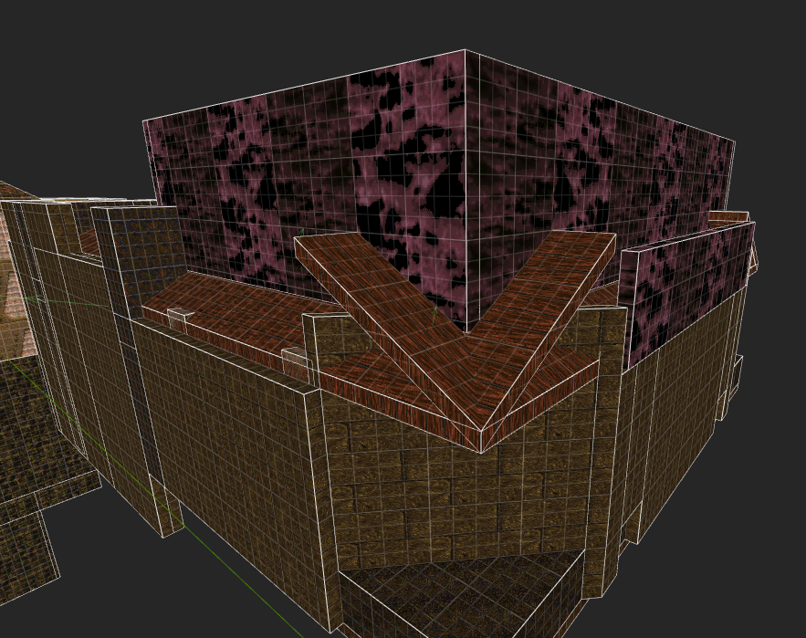 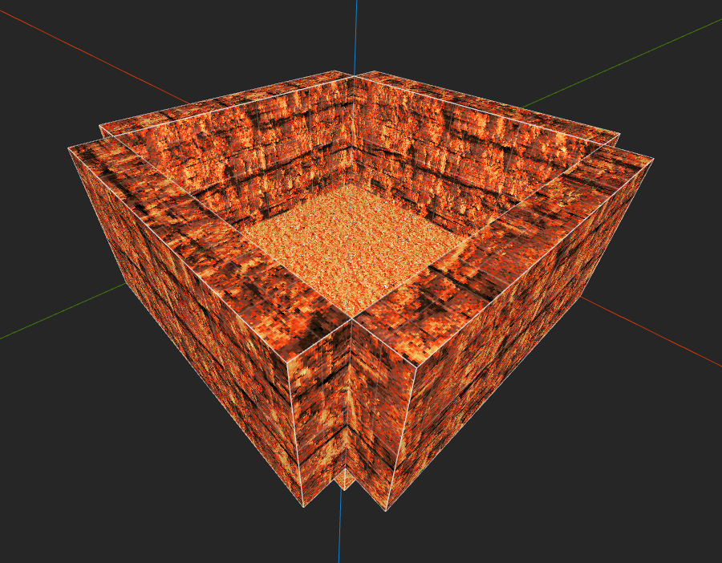

... we don't get the same result.

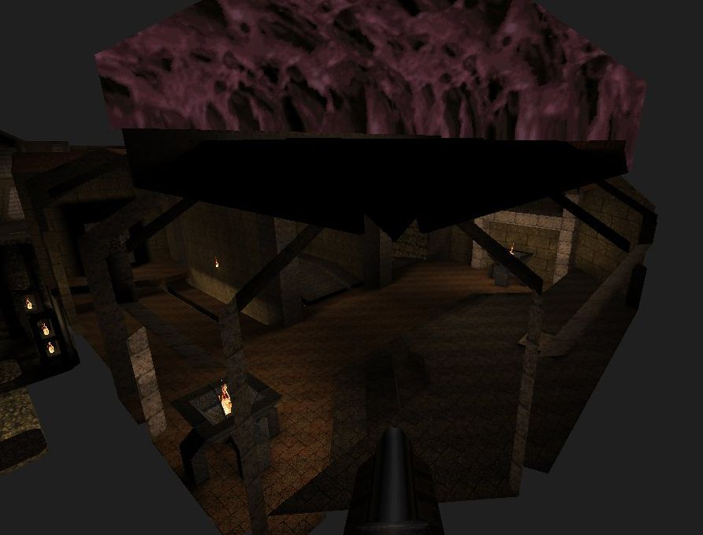 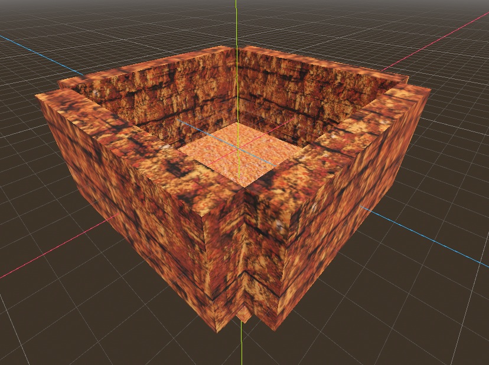

Instead we need to change our approach.

For those not familiar with traditional Quake mapping, the finished MAP gets compiled into a BSP file to be read by the engine. The compiling process calculates visibility between all of the rooms of your map and removes all faces that won't be viewed due to being outside the map. That means maps must be sealed completely, but you're also allowed to be lazy with brush texturing since if a face is "outside" the map it will get culled.

With Godot we need to think of these brushes as what they'll become in-engine: composited **MeshInstance3Ds** and **CollisionShape3Ds**. If we want to achieve the culled result on the left, we'll need to change the way we do things on the right.

## Skip

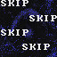

The **Skip** texture is arguably our most important texture when mapping for Godot. Whatever texture is set as the QodotMap's Skip texture will be used to cull any face textured with it from the generated mesh. Currently this only applies to the Mesh resource, but some of us are almost done implementing a change that will allow it to remove faces from generated **ConcavePolygonShape3Ds**.

The **Clip** texture will cull the Mesh face, too. In a future update it will maintain collision on a Concave Solid Entity, as opposed to Skip's future removal of it. Just keep in mind the general rule of thumb: if you want your entities to collide with it, use Clip.

Let's go ahead and fix our map up. Build a small room with a 256x256 floor and no roof and turn it into a `func_geo` brush entity. Then completely texture it with _Skip_. We should have something like this.

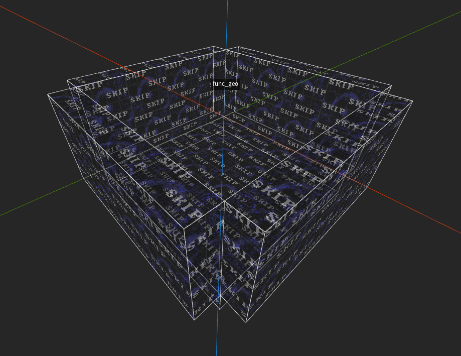

Next you'll want to texture just the inside faces of the func_geo.

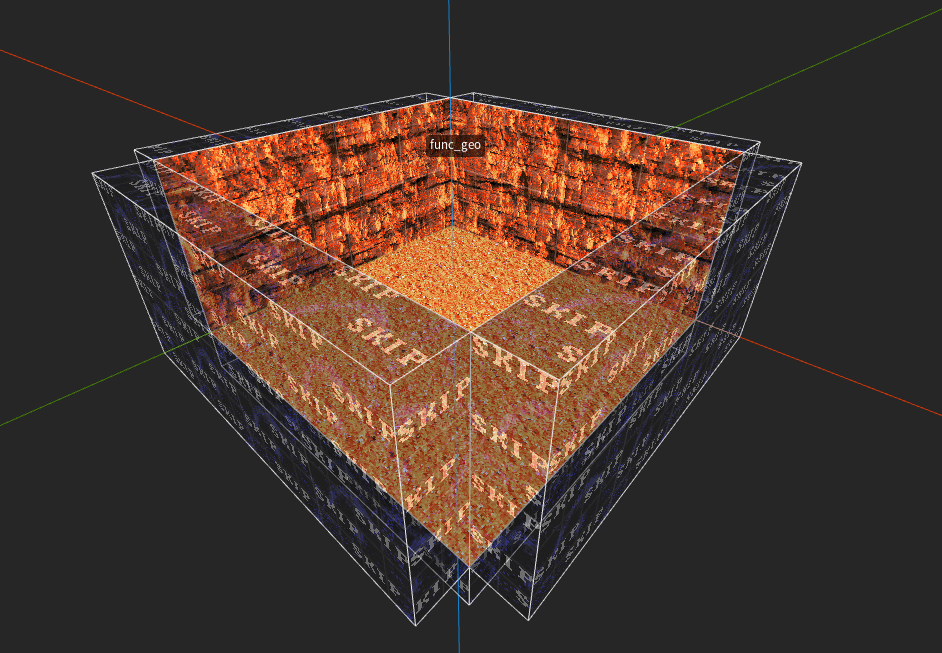

You can already see the TrenchBroom Tag we made earlier in action. Additionally we've got some other options we can play with to further alter our view.

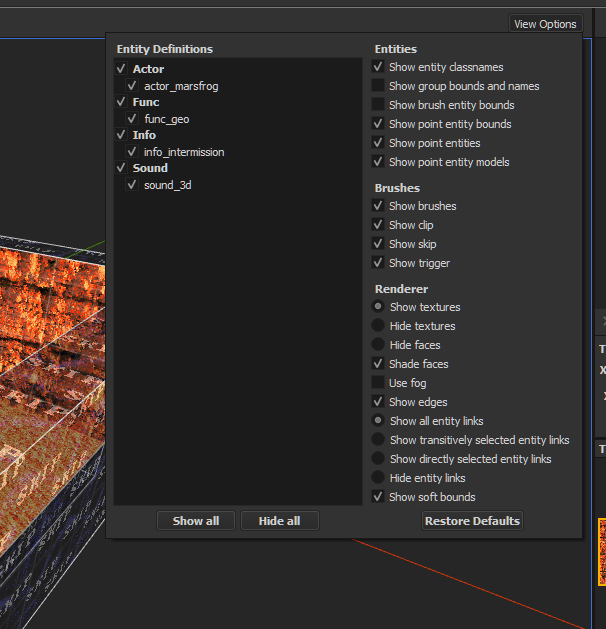

You'll want to leave `Show clip/skip/trigger` on for now, but if you want a quick preview of what your map will look like in Godot that's where you'll find it.

You'll also notice that we have the Entity Groups I promised way back when we talked about [**naming patterns**](entities.md#naming-patterns). Neat.

Speaking of entities...

## Targeting All Marsfrogs!

Your new objectives:

- Create an `info_intermission` somewhere in the room. Use `mangle` to point it towards the center of the floor.

- Create a `sound_3d` in a corner of the room. Set its `sound` to `amazing.wav`, its `target` to `froggy`, and its `message` to `Little Marsfrog! Little Marsfrog!`.

- Create an `actor_marsfrog` in the middle of the room on the floor. Set its `targetname` to `froggy`. Modify `angle` if desired.

- Create a second `actor_marsfrog` next to it. Set its `appearance_flags` to `Not on Normal`. Modify `angle` if desired.

You should have a map that looks more or less like this:

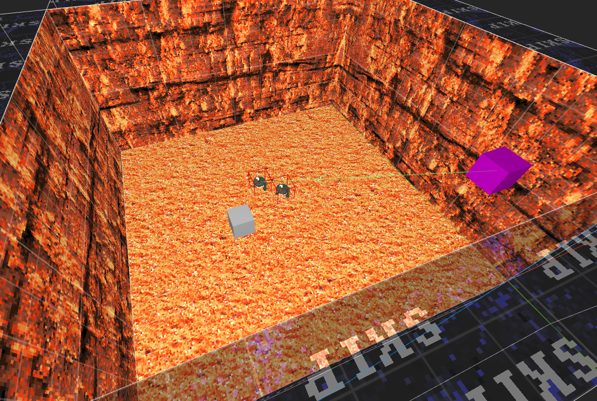

Qodot does not require us to compile the map. Save the map in your project's _tb_ folder. Do ***NOT** save it in the _maps_ folder. [**Recall the .gdignore file we created for our Autosave folder**](setup.md#autosave). This is only located in the _tb/autosave/_ folder. If you save the map in the _maps_ folder it will create a new _autosave_ folder and begin saving backups to it, unnecessarily importing superfluous map files.

Once you've saved the map file, it's time to go back to Godot.

### [**_Next Chapter: Building the QodotMap >>>_**](qodotmap.md)

---

<a href="../readme.md">Home</a> |
<a href="qodot.md">What <i>IS</i> Qodot?</a> | 
<a href="setup.md">Setting Up Your Project</a> | 
<a href="gamemanager.md">The Game Manager Autoload</a> | 
<a href="entities.md">What's an Entity?</a> | 
<a href="baseclass.md">Base Classes and Property Definitions</a> | 
<a href="solidclass.md">Solid Entities</a> | 
<a href="pointclass.md">Point Entities, Part 1</a> | 
<a href="pointclass2.md">Point Entities, Part 2</a> | 
<a href="gameconfig.md">Game Configuration</a> | 
<a href="fgd.md">Forge Game Data</a> | 
<a href="textures.md">Textures!</a> | 
<a href="trenchbroom.md">Finally. TrenchBroom.</a> | 
<a href="qodotmap.md">Building the QodotMap</a> | 
<a href="resources.md">Helpful Resources</a>

